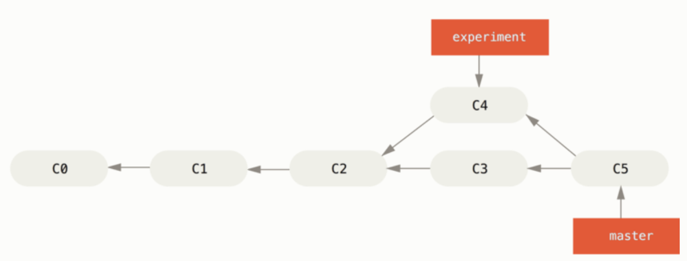
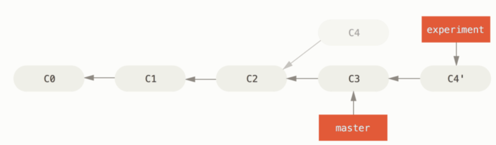
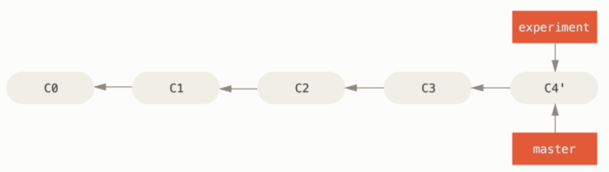

[toc]

# How to install git

```bash
brew install git
git --version
```

# How to upload your public SSH key to Github

For details on generation of SSH keys, see git.md

1. Login to your GitHub account and go to https://github.com/settings/profile
2. Click on “SSH and GPG Keys” to load the SSH key management page.
3. Click on “New SSH key”
4. Enter an appropriate title name.
5. Paste the public SSH key in the key text box.
6. Click on “Add SSH key”

# Test your GitHub authorization

```bash
git clone git@github.com:<Name>/<Name>.git
# or
ssh -T git@github.com
```

# Git Commands

## Common terms

- `origin` - default repo
- `master` - default branch
- `origin/master` - is a remote tracking branch on local. This is not a local branch. Its hidden and is supposed to stay in sync with `master` on remote  `origin`.
- Working Directory -> Staging -> Head.
  - `add` updates Staging
  -  `reset` overrides Staging with last commit on Head. You undo an `add` with a `reset`.
  - `checkout` overwrites working directory with a copy from staging. You undo an edit with `checkout`.

## Ignoring files

```bash
$ cat .gitignore
*.[oa]
*~
# ignore all .a files
*.a
# but do track lib.a, even though you're ignoring .a files above
!lib.a
# only ignore the TODO file in the current directory, not subdir/TODO
/TODO
# ignore all files in any directory named build
build/
# ignore doc/notes.txt, but not doc/server/arch.txt
doc/*.txt
# ignore all .pdf files in the doc/ directory and any of its subdirectories
doc/**/*.pdf
```

## Working with Local Repo

```bash
# create local repo
mkdir <dir>
cd <dir>
git init

# ... make some changes

# add
git add .  # or
git add -i # interactive add

# commit
git commit -m 'some comment'

# Combine add and commit
git commit -a # implicitly add files already existing in the last commit
# Git stages every file that is already tracked before doing the commit

# status
git status # shows which files changed
git status -s # short version
```

## Working with Remote

> Remote repo must exist before hand. There is no git cli to create a remote repo.

```bash
# clone a remote repo 
git clone <git_url> <desired_output_directory>

# Connect a local to remote repo
git remote add <remote_repo_name> https://github.com/<your_username>/<repo>.git
git remote add origin https://github.com/<your_username>/<your_repo>.git

# Commands below are same. They create the remote tracking branch on local
git push -u origin master 
git push --set-upstream origin master

# example: setup upstream branch using git push
git checkout -b new_branch
git branch -vv # won't show a tracking branch for new_branch
git push -u origin new_branch # or..
git push -u origin HEAD
git branch -vv # now shows a tracking branch for new_branch
# contd. use alias on git config
git config --global alias.pushd "push -u origin HEAD"
git pushd
# contd. use alias on bash
alias gp='git push -u origin HEAD'
gp

# example: You have a local folder 'dev' which is not yet tracked against an existing remote
cd dev # assumed already on local git
git checkout --track origin/dev # or..
git branch -u <remote>/<branch> # local branch exists

# fetch and pull
git fetch <remote_repo_name> # fetch and pull from remote into staging
git pull # fetches and merges into working directory

# optionally Curl can create a remote repo on github
curl -u <your_username> \ 
       -H "Content-Type: application/json" \ 
       -d '{"name":"<repo_name>"}' https://api.github.com/user/repos

# show remote servers configured on local
git remote # by default it would show origin
git remote -v
git remote -vv # also include tracking branches on local
git remote show <remote> # inspecting a remote
git remote show origin 

# rename a remote
git remote rename <old_name> <new_name>

# remove a remote
git remote remove <remote_to_be_removed>

# example: create remote from local
brew install hub
cd localrepo
git init
git add .
git commit -m "first commit"
hub create
git push -u origin HEAD

```

`push` works only if you cloned from a server to which you have write access and nobody has pushed in the meantime. Since remote is a moving branch, its possible that the push to include your local changes on remote may fail.  Read #Checkout for more details. Here’s how you address it:

```bash
# Refresh the tracking branch. This is a remote tracking branch on lcoal
git fetch origin master

# Integrate our changes with remote changes
git rebase origin/master

# The above two commands can be combined into one command
git pull --rebase origin master

# Finally attempt the push to remote again
git push origin master
```

## Diff Command

```bash
git diff # diff between Working directory and Staging
git diff --cached # diff between Staging and HEAD
git diff --staged # what's in Staging which will go to Head on next commit. This will not show all changes, only what is staged.

# diff between some-branch and Working directory
git diff <source_branch> <target_branch>
git diff <some-branch>
git diff HEAD

# diff between two commits
git diff first-commit last-commit
```

## Log Command

> By default, `git log` will only show commit history of the branch you’ve checked out.

```bash
git log # too long
git log -p -2 # shows last 2 commit details
git log --since=2.weeks # list of commits in last two weeks
# you can specify "2008-01-15", "2 years 1 day 3 minutes ago"
git log --stat

git log --pretty=oneline # compressed log view
git log --oneline --decorate # shows where the branch pointers are pointing
git log --pretty=format:"%h %s" --graph
git log --oneline --decorate --graph --all
git log --pretty=format # shows format help
git log --pretty=format:"%h - %an, %ar : %s"
git log --author=bob # commits by certain author
git log --graph --oneline --decorate --all # decorated
git log --name-status # which files have changed
git log --since=2.weeks # --before, --after, --until
git log --since="2 years 1 day 3 minutes ago"

# commits but not merged
git log --pretty="%h - %s" --author='Junio C Hamano' --since="2008-10-01" --before="2008-11-01" --no-merges -- t
```

## Checkout Command

When dealing with a branch (say, `master`) copied from a remote repository (say, `origin`), there are *three* branches one must consider:

1. The copy of `master` in the local repository
2. The copy of `master` in the remote repository
3. The local branch `origin/master` that records the last known position of the remote branch. Branch 3 tracks (tracking branch) the remote branch, not because it is itself a remote branch, its a local copy of the remote branch. 

The `fetch` command copies branch (2) to (3).

```bash
git fetch origin master
```

The `checkout` command copies branch [3] to [1].

```bash
git checkout master
```

The `push` command copies branch (1) to (2), and incidentally updates (3) to match with (2).

```bash
git push origin master
```

Copy files from Head or Staging to the Working Directory, and to optionally switch branches. 

- If the commit name is provided, the files are copied from commit to staging and wd.
- If commit name is not provided, the files are copied from staging  to wd.

## Reset Command

Moves the current branch to another position, and optionally updates the stage and the working directory. It also is used to copy files from the history to the stage without touching the working directory.

```bash
# default to HEAD and copies to staging, doesn't touch wd
git reset

# default to HEAD and copies only the mentioned files into staging, doesn't touch the wd
git reset -- files 

# default to HEAD and copies to staging and wd
git reset --head

# HEAD~3 means N-3 commit.
git reset HEAD~3 # copies history into staging only
git reset HEAD~3 --hard # copies history into staging and wd
git reset HEAD~3 --soft # simply moves the HEAD, doesn't copy to staging or wd
```

## Remove Files

To remove a file from Git, you have to remove it from your tracked files (more accurately, remove it from your staging area) and then commit. The `git rm` command does that, and also removes the file from your working directory so you don’t see it as an untracked file the next time around.

```bash
rm <file> # removes untracked files or files in WD, but not in S
git rm <file> # removes from staging and working directory
git rm --cached FILENAME # remove from staging, retain in working directory
git commit -f # file is gone

git rm --cached <file> # retains in WD, but removes from S
git rm log/\*.log # removes all files with .log extension
git rm \*~ # removes all files ending in ~
```

## Moving Files

Git doesn’t explicitly track file movement. If you rename a file in Git, no metadata is stored in Git that tells it you renamed the file. However, Git is pretty smart about figuring that out after the fact.

```bash
git mv file_from file_to

# above is equivalent to following
mv file_from file_to
git rm file_from
git add file_to
```

## Undo Things

### You committed early

If you commit and then realize that you forgot to stage the changes in a file you wanted to add to this commit, you can:

```bash
git commit -m 'Initial commit' # some file(s) forgotten.
git add <forgotten_files>
git commit --amend 
```

### Unstage a staged file

Let’s say you’ve changed two files and want to commit them as two separate changes, but you accidentally type `git add *` and stage them both. How can you unstage one of the two?

```bash
# file-a and file-b added to Staging
git add *

# unstage file-b
git reset HEAD file-b 

# file-a is committed
git commit -m 

# stage file-b
git add file-b

# commit file-b as a separate commit
git commit -m 
```

### Unmodify a modified file

You realize that you don’t want to keep your changes to the `file-b`? How can you revert it back to what it looked like when you last committed

```bash
git checkout -- file-b
```

### Undo commits permanently

```bash
git commit ... # mistake(s)
# The last three commits HEAD, HEAD-1, HEAD-2 are bad and you don't want to commit them again. 
git reset --hard HEAD~3 # T
```

### Undo a commit and redo

```bash
git commit ... # mistake
git reset --soft HEAD^
# make the edits
git commit -a -c ORIG_HEAD
```

### Squashing commits

```bash
# you are in <my-feature>
git fetch origin
git reset --soft origin/master # Moves HEAD to last commit of Remote
git commit 
git push origin feature/<my-feature> -f # fix the error
```

## Tagging

```bash
# list
git tag
git tag -l "v1.8.5*" # shows only tags with v1.8.5.*

# create tag
git tag -a v1.4 -m "tag comment"
git tag

# lightweigh tag, only stores checksum
git tag v1.4-lw
git tag
git show v1.4-lw

# tag a previous commit
git tag -a v1.4 <some-prefix-of-commit-checksum>
git tag -a v1.4 9fceb02

# push tag
git push <remotename> <tagname>
git push origin v1.4 # a generic git push will not push tag

# delete tag
git tag -d v1.4-lw # delete from local
git push origin --delete v1.4 # delete from remote

# checkout tag
git checkout v1.4 # just for exploration and discarding
git checkout -b version2 v1.4
```

## Branching

```bash
# creates the 'master' branch in the 'origin' repo that will be created on local
git init 

# create a new branch (two commands)
git branch new_branch_name # create
git checkout new_branch_name # switch to it

# create a branch (combined into single command)
git checkout -b new_branch_name # create and switch
git branch -vv # check tracking branches on local

# example: simple flow
# feature branch
git checkout master
git checkout -b dev_branch # new feature branch
vim index.html
git commit -a -m "create new footer"
# hotfix
git checkout master
git checkout -b hotfix # new hotfix branch
vim index.html
git commit -a -m "fix email address"
git checkout master
git merge hotfix # merge hotfix branch into master
git branch -d hotfix
# continue on feature branch
git checkout dev_branch
vim index.html
git commit -a -m "finish the new footer"
git checkout master
git merge dev_branch # no merge conflict
# if merge conflict, update index.html on master
git add index.html
git commit -m "Final commit"
git branch -d devbranch

##### Merge A into B
git checkout B
git fetch A
git merge A
# or
git checkout B
git pull A # does the fetch and merge

# example: create a branch from master and push the branch to remote
git pull origin master # Make sure local repo matches with remote
git checkout -b <new-branch-name> # create branch and switch to it
git push origin <new-branch-name>

# management
git branch # list of current branches
git branch -all
git branch -v # last commit on each branch
git branch --merged # list of branches merged into the branch you're on.
git branch --no-merged # list of branches you haven't yet merged in. 
git branch --no-merged master # list of branches not merged into the master
git branch -av
git branch -avv # which remote branches are linked to your local branch
git remote -v # what remote branches exist

# rename branch
git branch --move old_branch_name new_branch_name # rename branch on local
git push <remotename> <localbranchname>:<remotebranchname>
git push --set-upstream origin new_branch_name # add new branch on remote
git push origin --delete old_branch_name # delete old branch on remote

# delete branch
git branch -d my-branch # local
git push <remotename>:<branchname> # remote
git push origin :my-branch 	# remote
git push origin :branch1 :branch2 :branch3

# create a branch and push to remote
 git checkout -b my-branch	# create branch and switch to it

# make changes, git add, git commit -m etc...
# push the branch to remote for others to see
 git push <remotename> <branchname> # first time
 git push -u origin my-branch <can be master> 

# remote branches
 git ls-remote <remote> # list of remote branches
 git remote show <remote>

# synchronize local from remote, will only change S, not WD
git fetch <remote>
git fetch origin

# synchronize local from remote, change S and WD
git pull
# same as
git fetch
git merge

# push branch to remote
git push <remote> <local_branch>
git push origin my_branch

# someone else
git fetch origin # will get origin/my_branch on local
git checkout -b copy_of_my_branch origin/my_branch # now has a local branch

# delete remote branch
git push origin --delete mybranch

# drop all changes in local
git fetch origin # fetch latest
git reset --hard origin/master # switch local master to it

# replace some local changes, not everything
git checkout --<filename>

# copies last commit to both Staging and WD
git checkout HEAD -- files 	

# switches Working directory  and Staging to last commit in HEAD
git checkout HEAD 		

# pushing local dev branch to master
git push origin dev:master

# update local with newest commit
git pull # this does fetch and merge

#merge another branch to your branch
git merge <branch>

# pulling a different branch to local
git pull origin master:dev

# rebasing - integrate changes from one branch into another
# use merge or rebase which provides cleaner history
```

## Rebase

There are two main ways to integrate changes from one branch into another: the `merge` and the `rebase`.  The `rebase` offers a cleaner history, while the `merge` will offer full transparency.

```bash
# experiment has C4 made on C2
# master has C3 made on C2
# C2 is the common ancestor
git checkout experiment
git rebase master # Add experiment to master on C3

# above two commands can be replaced with
git rebase master experiment

# merge 
git checkout master # new changes are on existing commit C3
git merge experiment # master + experiment are now on C4
```







# Merging

Confirm the receiving branch. 

```bash
# ensure HEAD is pointing to correct merge receiving branch
git status 

git checkout <receiving> # i.e.
git checkout master
```

Make sure the receiving and the from (merging) branch have the latest commits

```bash
git fetch
git pull
```

Merge now

```bash
git merge <from-branch>
```

Example of a fast-forward merge:

```bash
git checkout -b new-feature master
git add <files>
git commit -m "some comment"

git checkout master
git merge new-feature # or
git merge --no-ff new-feature 

git branch -d new-feature
```

Example of a three-way merge:

```bash
git checkout -b new-feature master
# edit some files in new-feature
git add <files>
git commit -m "some comment"

git checkout master
# edit some files in master
git add <files>
git commit -m "some comment"

# Merge in the new-feature branch
git merge new-feature
git branch -d new-feature
```


# Git Config

```bash
git config --global user.name "John Doe"
git config --global user.email johndoe@example.com
git config color.ui true
git config format.pretty oneline
git help config
```

# Pull Request

To create a PR, you must have the changes committed to the branch.

https://yangsu.github.io/pull-request-tutorial/

https://hackernoon.com/how-to-git-pr-from-the-command-line-a5b204a57ab1

# File status

File status: `untracked`, `unmodified`, `modified`, `staged`.
* `untracked` is a new file not in previous commit snapshot. `untracked` gets tracked only after add.
* add: moves file from `untracked` to `staged`
* edit: moves file from `unmodified` to `modified`
* add: moves file from `modified` to `staged`
* commit: moves file from `staged` to `unmodified`
* remove: moves file from `unmodified` to `untracked`

# Standard practice

* Two main branches: `origin`, and `develop`
* Multiple supporting branches: `features`, `release-*`, and `hotfix-*`

```bash
# create feature branch from develop
git checkout -b myfeature develop

# feature is now stable and ready to move forward
git checkout develop
git merge --no-ff myfeature

# push develop 
git push origin develop # pushes branch develop to remote origin
git push origin dev:master # optionally pushes local branch to remote's master branch

# create release branch on develop
git checkout -b release-1.2 develop

# release is now stable
git checkout master
git merge --no-ff release-1.2
git tag -a 1.2

# the changes done in release need to be available to develop
git checkout develop
git merge --no-ff release-1.2

# delete release 1.2
git branch -d release-1.2 # delete on local
git push origin --delete release-1.2 # delete on remote

# create hotfix on master
git checkout -b hotfix-1.2.1 master

# do some work on hotfix
git commit -a -m "some hot fix into 1.2.1"
git checkout master
git merge --no-ff hotfix-1.2.1
git tag -a 1.2.1
git tag 1.2.1 1b2e1d63ff # first 10 of the commit id

# changes done in hotfix need to be available to develop
git checkout develop
git merge --no-ff hotfix-1.2.1

# delete local branch of hotfix
git branch -d hotfix-1.2.1
# delete remote branch of hotfix
git push origin --delete hotfix-1.2.1
```

# Bash alias

```
grbi 	- git rebase -i master
git rebase -i --autosquash
gcane - git commit -amend --no-edit
grbc	- git rebase --continue
push	- git push origin `git rev-parse --abbrev-ref HEAD`
gll 	- git log --oneline --decorate
gcf 	- git commit --fixup <commit>

# ~/.gitignore_global can have .gitignore entries
```

# Reference

http://marklodato.github.io/visual-git-guide/index-en.html

https://hackernoon.com/git-push-and-pull-tips-and-tricks-7f9163539f02

https://ohshitgit.com/

https://git-scm.com/book/en/v2

[Git Push](https://careerkarma.com/blog/git-push/#:~:text=The%20git%20push%20command%20is,local%20copy%20of%20a%20repository.)