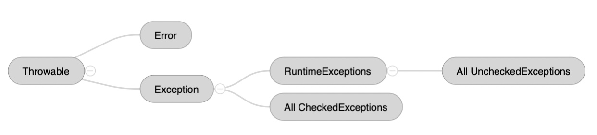
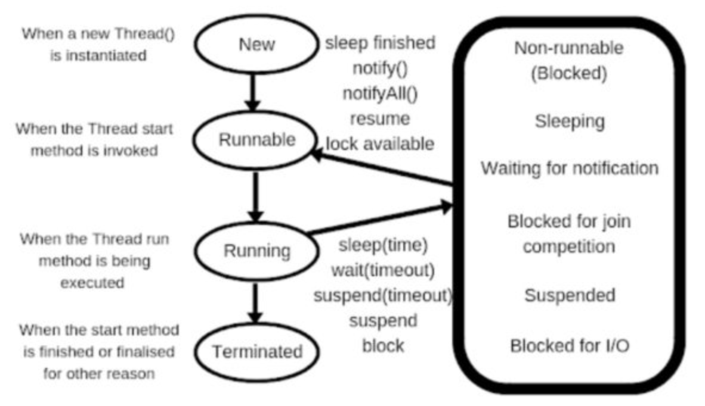

# Java Concurrency

[toc]

## Exceptions



## Thread State



- NEW - new thread instance, not yet started via `Thread.start()`. State switches to Runnable at start. 

- RUNNABLE - a potentially running thread, waiting for the next slot from the scheduled. 
- RUNNING - a running thread.
- BLOCKED -  a running thread becomes blocked if it needs to enter a sync section, but can’t. 
- WAITING - if it waits for another thread to perform a particular action when it called `Object.wait()` or `Thread.join()`.
- TIMED_WAIT - same as above, but thread waits after calling a timed version of `Thread.sleep()` etc.
- TERMINATED - thread has completed the execution of its `run()` method and terminated. 

## User and Daemon Thread

* **User threads are ==high-priority== threads** and JVM will wait for user thread to complete its task before terminating it.
* **Daemon threads are ==low-priority== threads who provide services to user threads**. Since daemon threads are only needed while user threads are running, they won’t prevent the JVM from exiting once all user threads have finished their execution. Daemon threads are not recommended for I/O tasks, as code won't execute once the user threads have finished execution. 

### Thread size commands

```bash
$ java -XX:+PrintFlagsFinal -version | grep ThreadStackSize
$ java -XX:+UnlockDiagnosticVMOptions -XX:NativeMemoryTracking=summary -XX:+PrintNMTStatistics -version
```
* **Reserved** — the size which is guaranteed to be available by a host's OS (but still not allocated and cannot be accessed by JVM) — it's just a promise
* **Committed** — already taken, accessible, and allocated by JVM
### I/O Bound

Condition in which the time it takes to compute is primarily determined by the period spent waiting for I/O to complete. Rate at which data is consumed is faster than the rate at which data is requested. This issue has been since inception of computers. Based on Von Neumann's architecture of a ALU, Processing Unit, Memory - where instruction fetch and data fetch can't happen at the same time because they share the common bus to access memory. Later Harvard architecture brought the concept of splitting instruction and data into separate buses or cache between CPU and memory. 

> Most modern architectures include hardware cache, closer to the CPU - instruction cache, data caches - further broken into L1, L2, L3, L4 etc.  L1 cache are split into instruction and data. L1 and L2 are typically per core, and L3 are shared by all cores. 

### CPU Bound

Condition where the time it takes to complete the task is determined by the speed of the CPU. Loads are getting decentralized with use of multiple buses, parallel processing, dedicated CPUs in components such as graphics and sound cards. The bottleneck effect is shifting to _between_ components.

### Memory Bound

Condition where the time it takes to complete the task is determined by the amount of memory required to hold the data. Concept of memory functions run in linear time and helps address the problems of recursion which run in exponential time. Results of each function are held for future reuse.

### Non-blocking

Failure or suspension of one thread doesn't cause other threads to fail.

## Lock

### Monitor

Synchronized blocks use `monitor` or intrinsic lock. The monitor is bound to the object and can have only one thread executing them at the same time. Limited to block of lines within a method. A thread that owns the object's monitor (for instance, a thread that has entered a *synchronized* section guarded by the object) may call `object.wait()` to temporarily release the monitor and give other threads a chance to acquire the monitor. 

When another thread that acquired the monitor fulfills the condition, it may call `object.notify()` or `object.notifyAll()` and release the monitor. The *notify* method awakes a single thread in the waiting state, and the *notifyAll* method awakes all threads that wait for this monitor, and they all compete for re-acquiring the lock.

### Semaphores

Semaphores are signaling mechanism for locking controls. Two operations: `wait()` (entering a critical region) and `signal()` (leaving a critical region) allow for a variable value to decrement to 0 or increment. A value of 0 means that a requesting thread is blocked until the value is higher than 0. A binary semaphore's max value is 1 and acts like a mutex. A counting semaphore's max value is greater than 1 and allows multiple threads access to the resource at the same time. Semaphores are exposed to deadlocks, mis-ordered wait/signal, not able to honor priority threads.

### Mutex

Mutex is an exclusive lock on object, its acquired and released. Other threads can't acquire the object if its locked. A mutex is a semaphore with a value of 1. A mutex unlike a semaphore offers ownership. The thread acquiring the mutex is the only thread that can release the mutex. A thread can't unlock a mutex it hasn't locked.This ownership addresses the issues with semaphore.

### Java Lock Interface

`Lock` offers better solutions compared to synchronized blocks. The `lock()` and `unlock()` operations can be in separate methods. `Lock` offers fairness by offering the lock to the longest waiting thread. `Lock` also offers `try` options to avoid getting blocked. A thread waiting to acquire a synchronized block can't be interrupted, but `Lock` has `lockinterruptibly()` to do this.

* tryLock(optional timeout)
* lock(), unlock()
* ReadWriteLock interface offers two locks - readLock(), writeLock().
	* if no thread acquired or requested the write lock, then multiple threads can acquire the read lock.
	* If no threads are reading or writing then only one thread can acquire the write lock.
* ReentrantLock is same as a synchronized block
* StampedLock also offers read/write locks, but a stamp that is returned when the lock is acquired has to be used to release the lock, and can also be used to check the status of the lock. This lock also offers optimistic locking
* wait(), notify(), notifyAll() - are old java methods.
	* `wait()` tells thread to give up the lock and go to sleep so that some other thread can enter the same monitor.
	* `notify()` signals to one thread to wake up and acquire the monitor.
	* `notifyAll()` signals to all waiting threads. Which thread gets the monitor depends upon thread priority and OS implementations.
* Condition offers more flexibility than wait() / notify() / notifyAll() methods. This provides the ability for a thread to wait for some condition to occur while executing the critical section. Condition.await() and Condition.notifyAll().
* CountDownLatch and CyclicBarrier expresses how thread(s) should wait, but address different needs.
	* With `countdownlatch` a thread waits on while other threads count down on a latch until it reaches zero. 
	> Waiter waits for a single dish containing n items to be prepared by multiple chefs, and n can arrive at different times. The dish is taken by waiter once all items are on the dish.
	* With `cyclicbarrier`, a group of threads wait together until all the threads arrive. 
	
	> Group of friends decide on a common point to meet and then all go to a restuarant together.
## Thread, Runnable and Callable

`Thread` execute tasks by implementing the `Runnable` interface and coding the task in the `run` method.

**Lamda version**

```java
//Using runnable
Runnable task = () -> { 
  //do something
}
task.run(); //on calling thread
new Thread(task).start(); //on new thread

//without using runnable
new Thread(() -> { 
	//do something
}).start();
```

**Pre-lamda  version**

```java
// pass the runnable task
Thread t = new Thread(new Runnable() {
  public void run() {
    //do something
  }
});
t.start();

// code the task in the thread as it already implements Runnable
Thread t = new Thread() {
  public void run() {
    //do something
  }
}
thread.start();
```

Both `Runnable` and `Callable` interfaces can execute a task by multiple threads. 

* A `Runnable` can't return result and can't throw an `CheckedException`. Its best for a fire and forget use case and can use the `Thread` or the `ExecutorService` class.
* A `Callable` can return result and can throw an `Exception`. It requires the use of `Future` and will block the calling thread. It can only use the `ExecutorService` class. Keep in mind that every non-terminated future will throw exceptions if the executor (below) is shutdown.

- https://www.baeldung.com/java-runnable-callable

##  Executor, ExecutorService, and Executors

* `Executor`is an core interface as an abstraction for parallel execution. It has a single method `execute` to submit a `Runnable` command. The command may execute an asynchronous task in a new thread or a pooled thread or in the calling thread, at the discretion of the implementation. 
* `ExecutorService` interface extends `Executor` to manage progress of tasks via `Future`  and termination of tasks. It provides a method `submit` and accepts a `Runnable` or `Callable`.
* `Executors` is a helper class to create pre-configured thread pools. Executors have to be stopped explicitly otherwise they continue to listen for more tasks. 
* `ScheduledExecutorService` schedules tasks after a given delay or periodically.
* https://javarevisited.blogspot.com/2017/02/difference-between-executor-executorservice-and-executors-in-java.html

```java
ExecutorService es = Executors.newSingleThreadExecutor();
es.submit(() -> {
    String threadName = Thread.currentThread().getName();
    System.out.println("Hello " + threadName);
});

// void execute(Runnable command)
es.execute(() -> System.out.println("Hello World"));
es.execute(new RunnableTask1());

// run on current thread
class DirectExecutor implements Executor {
   public void execute(Runnable r) {
     r.run();
   }
}

// run on a new thread
class ThreadPerTaskExecutor implements Executor {
   public void execute(Runnable r) {
     new Thread(r).start();
   }
}
```

### ExecutorService

```java
// Future<?> submit(Runnable command)
// <T> Future<T> submit(Runnable command, T result)
// <T> Future<T> submit(Callable command)

try {
	ExecutorService pool = Executors.newFixedThreadPool(10);
	// some operations
	Future<String> future = pool.submit(() -> "Hello World");
	String result = future.get();
    // future.get(10, TimeUnit.MILLISECONDS);
  pool.execute(someRunnable);  
} catch (IOException ex) {
  pool.shutdown();
}

// proper way to shutdown
void shutdownGracefully() {
  pool.shutdown(); //disable submitting of new tasks, on-going tasks are not terminated
  try {
    // Wait a while for existing tasks to terminate
     if (!pool.awaitTermination(60, TimeUnit.SECONDS)) {
       pool.shutdownNow(); // Cancel currently executing tasks
       // Wait a while for tasks to respond to being cancelled
       if (!pool.awaitTermination(60, TimeUnit.SECONDS))
           System.err.println("Pool did not terminate");
     }
  } catch (InterruptedException ie) {
     // (Re-)Cancel if current thread also interrupted
     pool.shutdownNow();
     // Preserve interrupt status
     Thread.currentThread().interrupt();
   }
}	
```

The `Future` Interface was introduced in Java 5 to model an asynchronous computation and provide a reference to a result that is available only when the computation is completed. It delegates the long-lasting operation to a separate thread while the main thread continues focusing on other tasks. When the main thread cannot proceed without the result of the asynchronous operation, it retrieves it from the Future by invoking its *get()* method. This method immediately returns the result of the long process (if completed) or blocks the main thread until the result is available.

## Thread Pools

Know the following types of thread pools. There are three standard implementations: `ThreadPoolExecutor`, `ScheduledThreadPoolExecutor`, and `ForkJoinPool`. In addition there are other modes:

* Cached - keep a number of threads alive, and create new ones as needed
* Fixed - limit the maximum number of threads. Additional threads wait in queue
* Single - Keep only one thread
* Fork/Join - Takes advantage of multiple processors, breaks a task into smaller tasks and runs it recursively. 

### CachedThreadPool

Used where there are a lot of **short-lived** parallel tasks to be executed. The number of threads of this executor pool is not bounded. If all the threads are busy executing tasks and a new task comes, the pool will create and add a new thread to the executor. As soon as one of the threads becomes free, it will take up the execution of the new tasks. If a thread remains idle for sixty seconds, they are terminated and removed from cache.

### FixedThreadPool(n)

Thread pool of a fixed number of threads. The tasks submitted to the executor are executed by the `n` threads and if there is more task they are stored on a `LinkedBlockingQueue`. This number is usually the total number of the threads supported by the underlying processor.

However, if the tasks are not short-lived, the thread pool will have lots of live threads and may lead to resource thrashing and hence performance drop.

### SingleThreadExecutor

Has only a single thread and execute tasks in a sequential manner. If the thread dies due to an exception while executing a task, a new thread is created to replace the old thread and the subsequent tasks are executed in the new one.

### ScheduledThreadPool

Schedule tasks to execute after a given delay, or to execute periodically. Consider using this executor if you want to schedule tasks to execute concurrently.

### SingleScheduledExecutor

Used when we have a task that needs to be run at regular intervals or if we wish to delay a certain task. `scheduleAtFixedRate` or `scheduleWithFixedDelay`.

### ForkJoinPool

Implements `ExecutorService`. A `ForkJoinTask` is a thread-like entity, lighter-weight than normal thread. So huge number of such tasks can be hosted by a small number of threads in `ForkJoinPool`. Such tasks are usually computing-only, likely on isolated objects, so blocking is mostly avoidable. `Fork` starts the task, `Join` returns the result. The pool uses `work-stealing` approach, and usually daemon threads. 

The **ForkJoinPool** makes it easy for tasks to split their work up into smaller tasks which are then submitted to the **ForkJoinPool** too. Tasks can keep splitting their work into smaller subtasks for as long as it makes sense to split up the task. Worker threads in the ForkJoinPool implement a “workstealing” algorithm — allowing idle threads to steal from busy threads. The task is (mostly) evenly distributed across the threads in the ForkJoinPool held in a doubly-linked queue. However, some threads might complete their tasks faster than others. In such a case, rather than sit idle, threads randomly choose another queue and start “stealing” the task. This goes on until all queues across all threads are empty and the task is completed.

The Fork/Join essentially ensures CPU cores run at maximum efficiency.

## Queue

`Queue` typically, but don't necessarily order elements as FIFO. Exceptions are PriorityQueue which order according to a comparator and `stack` which is LIFO. Queue operations are add, remove, element, poll, peek, offer.

* The `head` is the element that will be removed by a `remove` (throws exception when queue is empty) or `poll` (returns null when queue is empty). 
* The `element` and `peek` return the head but don't remove it. 
  * `element` will throw exception when queue is empty. 
  * `peek` will return null when the queue is empty. 
* All elements are inserted at the `tail`. 
  * The `add` throws exception when queue is full. 
  * The `offer` returns false if the element can't be added. 
  * The `put`, `take` block. The `offer` and `poll` also offer timeouts

### BlockingQueue

BlockingQueue can be bounded with a defined maximal capacity or be unbounded which can grow indefinitely. They are thread-safe.

* ArrayBlockingQueue - classic bounded blocking queue backed by an array.
* LinkedBlockingQueue - optionally-bounded queue backed by linked nodes.
* LinkedBlockingDeque - Deque allows insertion and removals at both ends. Also called double ended queue.
* LinkedTransferQueue - The producer blocks until consumer is ready to receive elements. Useful when message delivered acknowledgement is needed, or where backpressure is required.
* PriorityBlockingQueue - unbounded queue where ordering is based on some comparator. The head is the least element with respect to the specified ordering.
* SynchronousQueue is an exchange point for a single element between two threads, where one thread hands-off to the other. The queue has a put() and take() operation that operate as a synchronous pair. The put signal block until a take signal is received indicating that some thread is ready to take an element. The approach is better than CountDownLatch when it involves just a sending and receiving thread.
* DelayQueue - unbounded queue in which an element can only be taken when its delay has expired.

## CompletableFuture

1. Non-blocking
2. Ability to Programmatically completing a future
3. Perform Error handling
4. Ability to Chain several futures
5. Ability to combine results of multiple futures (that run in parallel)

### Complete a Future and Error Handling

```java
CompletableFuture<Double> futureResult = new CompletableFuture<>();
new Thread( ()-> {
    try {
    	//some long process
    	futureResult.complete(10.0);
    }	catch(Exception e) {
    	futureResult.completeExceptionally(e);
   	}
}).start();
return futureResult;
```

Both the `complete()` and `completeExceptionally()` methods help manually complete a `Future`.

### Complete a Future using Factory methods: runAsync and supplyAsync

- Accepts as input a Runnable and returns a `CompletableFuture<void>` 

- Accepts as input a Supplier and reutnr a `CompletableFuture<someValue>`  with value obtained by invoking the Supplier
- Optionally a custom Executor can be provided. Default is ForkJoin pool

```java
CompletableFuture<Void> future = CompletableFuture.runAsync(() -> {
    try {
        //long running process
        TimeUnit.SECONDS.sleep(2);
    } catch (InterruptedException e) {
     throw new IllegalStateException(e);
    }
});
```

```java
CompletableFuture<String> future = CompletableFuture.supplyAsync(() -> {
    try {
        //long running process
        TimeUnit.SECONDS.sleep(2);
    } catch (InterruptedException e) {
        throw new IllegalStateException(e);
    }
    return "supply Async";
});

try {
    String result = future.get(); //blocking 
} catch (InterruptedException e) {
    e.printStackTrace();
} catch (ExecutionException e) {
    e.printStackTrace();
}
```

### Chaining CompletableFutures - Non-blocking

- *getMovieList()* returns a CompletableFuture. This is the first CompletableFuture in the chain and created with a *supplyAsync()*

-  The next step is selecting a particular movie from the list retrieved, *thenCompose()* indicates that we want to execute another CompletableFuture and get its completion result

- Once the movie is selected, we now select seats by chaining each of the asynchronous tasks through *thenCompose()*

-  Before calculating the total price of the tickets, apply any promotional code through *applyPromoCode()*. Notice *applyPromoCode()* passed to the *thenApply()* does not return a Completable future. This task is synchronous and returns an object instead. If this task were to return a CompletableFuture, the result of *thenApply()* would be a nested CompletableFuture — < CompletableFuture<CompleteableFuture>>

  >  This is an important difference between *thenApply()* and *thenCompose()* where the latter returns a flattened result, synonymous to the difference between a *map()* and *flatMap()*

- The last step is to calculate the final ticket price and purchase the tickets

```java
// Get Movies playing for the selected showtime (date and time)
CompletableFuture<List<Movie>> getMovieList(String day) {
    return  CompletableFuture.supplyAsync( ()-> {
        List movieList = new ArrayList<Movie>();
        //getMovieList from backend
        return movieList;
    });
}

// Select seats for the movie
//ShowDetails includes movie selected, date and time of the movie, along with seats selected for that show
CompletableFuture<ShowDetails> selectSeats (ShowTime showTime) {
    return CompletableFuture.supplyAsync(() -> {     
        ShowDetails showDetails = new ShowDetails();
        showDetails.setSeats(selectSeatsForShow());
        return showDetails;
    });
 }

//Customer selects a movie from the movie list
CompletableFuture<Movie> selectMovie(List<Movie> movies){
    //user selects movie
    return CompletableFuture.supplyAsync(() -> {
        movie = getCustomerSelectedMovie();
        return movie;
      });
    }

//Calculate ticket price
CompletableFuture<TicketPrice> getTicketPrice (ShowDetails showdetails){
      return CompletableFuture.supplyAsync(() -> {
          ticketPrice = getTotalTicketPrice(); 
          return ticketPrice; //final price
      });
}

// Apply promo code if available
ShowDetails applyPromoCode (ShowDetails showdetails, String promoCode) {
    showdetails.setFinalDiscount(getDiscount(promoCode));
    return showdetails;
}

//Chaining
public void bookMyShow(ShowDetails showDetails, String promoCode)
{
    CompletableFuture result =                 		getMovieList(showDetails.getShowTime().getDay())
        .thenCompose(movies -> selectMovie(movies))
        .thenCompose(movie -> selectSeats(showDetails.getShowTime())
                     .thenApply(showDetails1 -> applyPromoCode(showDetails1,promoCode))
                     .thenCompose(showDetails2 -> getTicketPrice(showDetails2)));
}
```

### Multiple independent futures running in parallel

```java
CompletableFuture<String> getPopCorn() {
    CompletableFuture<String> future =  CompletableFuture.supplyAsync(() -> {
        return("Popcorn ready");
    });
    return future;
}

CompletableFuture<String> getDrink() {
    CompletableFuture<String> future = CompletableFuture.supplyAsync(() -> {
        return("Drink ready");
    });
    return future;
}

public String snackReady() {
    return "Order is ready - Enjoy your movie snacks";
}

//snacks are ready when popcorn and drink are ready
public void getSnacksForMovie(){
    CompletableFuture snacks = getPopCorn()
        .thenCombine(getDrink(),(str1,str2)->{return snackReady();}) ;
}
```

Both the *getPopCorn()* and *getDrink()* are executed in parallel. Once both of them have completed, they are passed as input to our supplier function to print the result *snackReady().* The input is a second CompletionStage and a supplier function that executes with the two results as arguments. The result returned is a new CompletionStage.