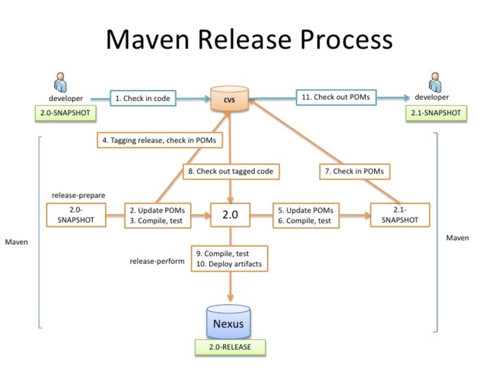

# Maven

[TOC]

---

## Maven variables

```
project.base.*
project.build.*
```

## Generating project

```bash
$ mvn archetype:generate -B -DarchetypeGroupId=org.apache.maven.archetypes -DarchetypeArtifactId=maven-archetype-quickstart -DarchetypeVersion=1.1 -DgroupId=org.deliwala -DartifactId=sample-project -DVersion=0.1-SNAPSHOT

# or shorter
$ mvn archetype:generate -B -DgroupId=org.deliwala -DartifactId=sample-project -Dversion=0.0.1 -DarchetypeArtifactId=maven-archetype-quickstart

# quiet clean
$ mvn -q clean package

# verbose clean
$ mvn -X clean package
```

## Compiler option

```bash
$ mvn compile
```

```xml
<!-- We specify the Maven compiler plugin as we need to set it to Java 1.8 -->
<plugin>
  <artifactId>maven-compiler-plugin</artifactId>
  <version>3.1</version>
  <configuration>
    <source>1.8</source>
    <target>1.8</target>
  </configuration>
</plugin>
```

## Skipping test

Using surefire plugin:

```xml
<plugin>
  <groupId>org.apache.maven.plugins</groupId>
  <artifactId>maven-surefire-plugin</artifactId>
  <version>2.19.1</version>
  <configuration>
    <skipTests>true</skipTests>
  </configuration>
</plugin>
<!-- or -->
<properties>
  <maven.test.skip>true</maven.test.skip>
</properties>
```

```bash
$ mvn -q clean package -DskipTests
$ mvn -q clean package -Dmaven.test.skip=true 
```

## Executing program in mvn

### `exec:java`

Class provided in command line

```xml
<!-- exec:java -D<args> -->
<plugin>
  <groupId>org.codehaus.mojo</groupId>
  <artifactId>exec-maven-plugin</artifactId>
  <version>?</version>
  <!-- no configuration, class injected from command line -->
</plugin>
```

Class provided in pom

```bash
mvn exec:exec
```

```xml
<plugin>
  <groupId>org.codehaus.mojo</groupId>
  <artifactId>exec-maven-plugin</artifactId>
  <version>?</version>
  <configuration>
    <mainClass>org.some.package.MainClass</mainClass>
  </configuration>
</plugin>
```

### `exec:java@App1`

Wire multiple main classes

```bash
mvn exec:java@App1
mvn exec:java@App2
```

```xml
<plugin>
  <groupId>org.codehaus.mojo</groupId>
  <artifactId>exec-maven-plugin</artifactId>
  <version>?</version>
  <executions>
    <execution>
      <id>App1</id>
      <configuration>
	    <mainClass>org.some.package.MainClass1</mainClass>
	  </configuration>
    </execution>
    <execution>
      <id>App2</id>
      <configuration>
	    <mainClass>org.some.package.MainClass2</mainClass>
	  </configuration>
    </execution>
  </executions>
</plugin>
```

Alternatively 

```bash
mvn exec:exec@run-app
```

```xml
<!-- or 3. using exec:java or exec:exec@run-app -->
<plugin>
  <groupId>org.codehaus.mojo</groupId>
  <artifactId>exec-maven-plugin</artifactId>
  <version>?</version>
  <executions>
    <execution>
	  <id>run-app</id>
	  <goals>
	    <goal>exec</goal>
      </goals>
	  <configuration>
	    <executable>java</executable>
		<arguments>
		  <argument>-jar</argument>
		  <argument>target/${project.artifactId}-${project.version}-fat.jar</argument>
		</arguments>
      </configuration>
	</execution>  
  </executions>
</plugin>
```

### exec:exec

```xml
<plugin>
  <groupId>org.codehaus.mojo</groupId>
  <artifactId>exec-maven-plugin</artifactId>
  <version>?</version>
  <configuration>
    <executable>java</executable>
		<arguments>
      <argument>-classpath</argument>
      <classpath />
      <argument>${mainClass}</argument>
      <argument>${port}</argument>
      <argument>-Xms512m</argument>
      <argument>-Xmx512m</argument>
      <argument>-XX:NewRatio=3</argument>
      <argument>-XX:+PrintGCTimeStamps</argument>
      <argument>-XX:+PrintGCDetails</argument>
      <argument>-Xloggc:gc.log</argument>
      <argument>${args}</argument>
		</arguments>
  </configuration>
</plugin>

<properties>
	<mainClass>some.package.Class</mainClass>
  <port>8080</port>
  <args>...</args>
</properties>
```

exec:exec@App

```xml
<plugin>
  <groupId>org.codehaus.mojo</groupId>
  <artifactId>exec-maven-plugin</artifactId>
  <version>?</version>
  <executions>
    <execution>
      <id>App1</id>
      <configuration>
	    <executable>java</executable>
     	<arguments>
	  	  <argument>-Xms512m</argument>
	  	  <argument>-Xmx512m</argument>
	  	  <argument>-XX:NewRatio=3</argument>
	  	  <argument>-XX:+PrintGCTimeStamps</argument>
	  	  <argument>-XX:+PrintGCDetails</argument>
	  	  <argument>-Xloggc:gc.log</argument>
	  	  <argument>-classpath</argument>
	  	  <classpath />
	  	  <argument>org.some.package.App1</argument>
	  	  <argument>${args}</argument>
		</arguments>
	  </configuration>
    </execution>
    <execution>
      <id>App2</id>
      <configuration>
	    <executable>java</executable>
     	<arguments>
	  	  <argument>-Xms512m</argument>
	  	  <argument>-Xmx512m</argument>
	  	  <argument>-XX:NewRatio=3</argument>
	  	  <argument>-XX:+PrintGCTimeStamps</argument>
	  	  <argument>-XX:+PrintGCDetails</argument>
	  	  <argument>-Xloggc:gc.log</argument>
	  	  <argument>-classpath</argument>
	  	  <classpath />
	  	  <argument>org.some.package.App2</argument>
	  	  <argument>${args}</argument>
		</arguments>
	  </configuration>
    </execution>
  </executions>
</plugin>
```

## Examples

```bash
# some examples run the program in the same jvm that loaded mvn.

# Example 1
$ mvn exec:java -Dexec.mainClass="org.some.package.MainClass" -Dexec.args="arg1 arg2"

# Example 2
$ mvn exec:java -Dexec.args="arg1 arg2"
$ mvn exec:java@App1
$ mvn exec:java@App2

# Example 3
$ mvn exec:java -Dexec.args="arg1 arg2"
$ mvn exec:exec@run-app
$ mvn exec:exec
$ mvn exec:exec@App1
```

## Generating fat-jar

```bash
$ mvn package
$ java -jar <outputfolder>/fat.jar
```

```xml
<plugin>
    <groupId>org.apache.maven.plugins</groupId>
    <artifactId>maven-dependency-plugin</artifactId>
    <version>?</version>
    <executions>
        <execution>
            <id>copy-dependencies</id>
            <phase>prepare-package</phase>
            <goals>
                <goal>copy-dependencies</goal>
            </goals>
            <configuration>          
                <outputDirectory>
                    ${project.build.directory}/{$project.build.finalName}.lib
                </outputDirectory>
                <excludeArtfiacts>junit</excludeArtfiacts>
                <overWriteIfNew>true</overWriteIfNew>
            </configuration>configuration>
        </execution>
    </executions>
</plugin>
```

Or..

```xml
<plugin>
    <groupId>org.apache.maven.plugins</groupId>
    <artifactId>maven-jar-plugin</artifactId>
    <version>3.0.2</version>
    <configuration>
        <archive>
            <manifest>
                <addDefaultImplementationEntries>true</addDefaultImplementationEntries>
                <addDefaultSpecificationEntries>true</addDefaultSpecificationEntries>
                <addClasspath>true</addClasspath>
                <classpathPrefix>${project.build.finalName}.lib</classpathPrefix>
                <mainClass>some.package.App</mainClass>
            </manifest>
        </archive>
    </configuration>
</plugin>
```

Or using `assembly`

```xml
<plugin>
    <groupId>org.apache.maven.plugins</groupId>
    <artifactId>maven-assembly-plugin</artifactId>
    <executions>
        <execution>
            <phase>package</phase>
            <goals>
                <goal>single</goal>
            </goals>
            <configuration>
                <archive>
                    <manifest>
                        <mainClass>
                            some.package.Class
                        </mainClass>
                    </manifest>
                </archive>
                <descriptorRefs>
                    <descriptorRef>jar-with-dependencies</descriptorRef>
                </descriptorRefs>
            </configuration>
        </execution>
    </executions>
</plugin>

```

Or using Shade

```xml
<plugin>
    <groupId>org.apache.maven.plugins</groupId>
    <artifactId>maven-shade-plugin</artifactId>
    <executions>
        <execution>
            <phase>package</phase>
            <goals>
                <goal>shade</goal>
            </goals>
            <configuration>
                <shadedArtifactAttached>true</shadedArtifactAttached>
                <!-- default is <project-name>-<version>-shaded.jar -->
                <finalName>user-${artifactId}-${version}</finalName>
                <transformers>
                    <transformer implementation=                        "org.apache.maven.plugins.shade.resource.ManifestResourceTransformer">
                        <mainClass>some.package.Class</mainClass>
                        <build-Number>123</buildNumber>
                    </transformer>
                </transformers>
                <filters>
                    <filter>
                        <artifact>*:*</artifact>
                        <excludes>
                            <exclude>META-INF/*.SF</exclude>
                            <exclude>META-INF/*.DSA</exclude>
                            <exclude>META-INF/*.RSA</exclude>
                        </excludes>
                    </filter>
                </filters>
            </configuration>
        </execution>
    </executions>
</plugin>
```

## Using profile

```bash
$ mvn -P<some-profile-name>
```

```xml
<profiles>
  <profile>
    <id>some-profile-name</id>
    <build>
      <plugins>
        <plugin>...</plugin>
      </plugins>
    </build>
    <properties>...</properties>
  </profile>
</profiles>

```

## Using Vertx embedded

> Vertx is embedded inside the program rather than used via verticle.

```xml
<properties>
    <!-- the main class -->
    <exec.mainClass>io.vertx.example.HelloWorldEmbedded</exec.mainClass>
</properties>
<plugin>
  <groupId>org.apache.maven.plugins</groupId>
  <artifactId>maven-shade-plugin</artifactId>
  <executions>
    <execution>
      <phase>package</phase>
      <goals>
        <goal>shade</goal>
      </goals>
      <configuration>
        <transformers>
          <transformer implementation="org.apache.maven.plugins.shade.resource.ManifestResourceTransformer">
            <manifestEntries>
              <Main-Class>${exec.mainClass}</Main-Class>
            </manifestEntries>
          </transformer>
          <transformer implementation="org.apache.maven.plugins.shade.resource.AppendingTransformer">
            <resource>META-INF/services/io.vertx.core.spi.VerticleFactory</resource>
          </transformer>
        </transformers>
        <artifactSet>
        </artifactSet>
        <outputFile>${project.build.directory}/${project.artifactId}-${project.version}-fat.jar</outputFile>
      </configuration>
    </execution>
  </executions>
</plugin>
```

## Using Vertx verticle

```xml
<properties>
  <!-- the main verticle class name -->
  <main.verticle>io.vertx.example.HelloWorldVerticle</main.verticle>
</properties>
<plugin>
  <groupId>org.apache.maven.plugins</groupId>
  <artifactId>maven-shade-plugin</artifactId>
  <executions>
    <execution>
      <phase>package</phase>
      <goals>
        <goal>shade</goal>
      </goals>
      <configuration>
        <transformers>
          <transformer implementation="org.apache.maven.plugins.shade.resource.ManifestResourceTransformer">
            <manifestEntries>
              <Main-Class>io.vertx.core.Launcher</Main-Class>
              <Main-Verticle>${main.verticle}</Main-Verticle>
            </manifestEntries>
          </transformer>
          <transformer implementation="org.apache.maven.plugins.shade.resource.AppendingTransformer">
            <resource>META-INF/services/io.vertx.core.spi.VerticleFactory</resource>
          </transformer>
        </transformers>
        <artifactSet>
        </artifactSet>
        <outputFile>
          ${project.build.directory}/${project.artifactId}-${project.version}-fat.jar
        </outputFile>
      </configuration>
    </execution>
  </executions>
</plugin>

<plugin>
  <groupId>org.codehaus.mojo</groupId>
  <artifactId>exec-maven-plugin</artifactId>
  <version>1.4.0</version>
  <executions>
    <execution>
      <id>run</id>
      <goals>
        <goal>java</goal>
      </goals>
      <configuration>
        <mainClass>io.vertx.core.Launcher</mainClass>
        <arguments>
          <argument>run</argument>
          <argument>${main.verticle}</argument>
        </arguments>
      </configuration>
    </execution>
    <execution>
      <id>run-app</id>
      <goals>
        <goal>exec</goal>
      </goals>
      <configuration>
        <executable>java</executable>
        <arguments>
          <argument>-jar</argument>
          <argument>target/${project.artifactId}-${project.version}-fat.jar</argument>
        </arguments>
      </configuration>
    </execution>
  </executions>
</plugin>
```

## Using Vertx maven service factory

> May not be recommended, as code depends on maven service factory.

```bash
# running the verticle
# pom for my-verticle has minimal settings
$ vertx run maven:io.vertx:maven-service-factory-verticle:3.8.1::my-verticle

# running the API to deploy the verticle
$ vertx run io.vertx.examples.MyDeployingVerticle -cp target/maven-service-factory-api-3.8.1.jar
```

```xml
<!-- for the API project -->
<dependency>
  <groupId>io.vertx</groupId>
  <artifactId>vertx-maven-service-factory</artifactId>
  <version>${project.version}</version>
  <classifier>shaded</classifier>
</dependency>
```

## Plugins

### Overview

https://www.baeldung.com/maven

### maven-resource-plugin

Copy resources to an output folder. It allows us to keep main and test resources separate in the project, and only use the main resources for the deployment purposes.

https://www.baeldung.com/maven-resources-plugin

```xml
<configuration>
    <outputDirectory>output-resources</outputDirectory>
    <resources>
        <resource>
            <directory>input-resources</directory>
            <excludes>
                <exclude>*.png</exclude>
            </excludes>
            <filtering>true</filtering> <!-- helps replace parameters in files -->
        </resource>
    </resources>
</configuration>
```

```bash
# copies all files except *.png from /input-resources to /output-resources
mvn resources:resources
# resources goal is bound to process-resource phase
mvn process-resources
```

> Replace property placeholders with values

```
<properties>
    <resources.name>Baeldung</resources.name>
</properties>

Welcome to ${resources.name}!
```

### maven-checkstyle-plugin

Two pre-defined checkstyles: https://github.com/checkstyle/checkstyle/tree/master/src/main/resources 

https://www.baeldung.com/checkstyle-java

```xml
<reporting>
	<plugins>
      	<plugin>
        	<groupId>org.apache.maven.plugins</groupId>
        	<artifactId>maven-checkstyle-plugin</artifactId>
            <version>...</version>
	        <configuration>
                <configLocation>checkstyle.xml</configLocation>
          		<logViolationsToConsole>true</logViolationsToConsole>
            	<skip>false</skip>
        	</configuration>
            <executions>
        		<execution>
            		<goals>
                		<goal>check</goal> <!-- run in verify phase of build -->
            		</goals>
        		</execution>
            </executions>
      </plugin>
    </plugins>
</reporting>
```

```bash
# runs checkstyle automatically
mvn clean install
# doesn't need the execution xml block in pom
mvn checkstyle:check
```

### maven-compiler-plugin

Plugin has two goals: `compile` and `testCompile`

```xml
<configuration>
    <source>1.8</source>
    <target>1.8</target>
    <!-- pass to javac -->
    <compilerArgs>
        <arg>-Xlint:unchecked</arg>
    </compilerArgs>
</configuration>

<!-- or -->
<properties>
    <maven.compiler.source>1.8</maven.compiler.source>
    <maven.compiler.target>1.8</maven.compiler.target>
</properties>
```

```bash
mvn compile
mvn test-compile
```

### maven-dependency-plugin

Provides goals to work with dependencies like copying, unpacking, analyzing, resolving and many more.

```xml
<plugin>
    <groupId>org.apache.maven.plugins</groupId>
    <artifactId>maven-dependency-plugin</artifactId>
    <executions>
        <execution>
            <id>copy-dependencies</id>
            <phase>prepare-package</phase>
            <goals>
                <goal>copy-dependencies</goal>
            </goals>
            <configuration>
                <outputDirectory>
                    ${project.build.directory}/libs
                </outputDirectory>
            </configuration>
        </execution>
    </executions>
</plugin>
```

We specify the goal *copy-dependencies*, which tells Maven to copy dependencies into the specified *outputDirectory*, in this case `/libs`.

---

https://crunchify.com/how-to-create-build-java-project-including-all-dependencies-using-maven-maven-resources-maven-dependency-maven-jar-plugin-tutorial/

https://www.baeldung.com/maven-dependency-latest-version

```xml
<plugin>
    <groupId>org.apache.maven.plugins</groupId>
    <artifactId>maven-dependency-plugin</artifactId>
    <version>3.1.1</version>
    <executions>
        <execution>
            <id>dependency-analyze</id>
            <phase>package</phase>
            <goals>
                <goal>analyze</goal>
            </goals>
            <configuration>
                <failOnWarning>true</failOnWarning>
                <ignoreNonCompile>true</ignoreNonCompile>
                <ignoredDependencies>true</ignoredDependencies>
                <outputXML>true</outputXML>
                <ignoredUnusedDeclaredDependencies>
                    <ignoredUnusedDeclaredDependency>commons-io:commons-io:jar:*</ignoredUnusedDeclaredDependency>
                </ignoredUnusedDeclaredDependencies>
                <ignoredUsedUndeclaredDependencies>
                 <ignoredUsedUndeclaredDependency>org.apache.httpcomponents:httpcore:jar:*</ignoredUsedUndeclaredDependency>
                </ignoredUsedUndeclaredDependencies>
            </configuration>
        </execution>

        <execution>
            <phase>validate</phase>
            <goals>
                <goal>copy</goal>
            </goals>
            <configuration>
                <outputDirectory>${project.build.directory}/endorsed</outputDirectory>
                <silent>true</silent>
                <artifactItems>
                    <artifactItem>
                        <groupId>javax</groupId>
                        <artifactId>javaee-endorsed-api</artifactId>
                        <version>6.0</version>
                        <type>jar</type>
                    </artifactItem>
                </artifactItems>
            </configuration>
        </execution>
    </executions>
</plugin>
```

```bash
mvn dependency:help
mvn dependency:help -Ddetail=true -Dgoal=analyze
mvn help:describe -Dplugin="org.apache.maven.plugins:maven-dependency-plugin"
mvn help:describe -Dplugin="org.apache.maven.plugins:maven-dependency-plugin" -Ddetail=true -Dgoal=analyze
mvn dependency:analyze
mvn dependency:resolve
mvn dependency:tree
mvn dependency:purge-local-repository
```

### maven-jar-plugin

This plugin provides the capability to build and sign jars. It compiles the java files under src/main/java and /src/main/resources/ and it *doesn't include the dependencies JAR files*.

```xml
<plugin>
    <groupId>org.apache.maven.plugins</groupId>
    <artifactId>maven-jar-plugin</artifactId>
    <configuration>
        <archive>
            <manifest>
                <addClasspath>true</addClasspath>
                <classpathPrefix>libs/</classpathPrefix>
                <mainClass>
                    com.some.main.Class
                </mainClass>
            </manifest>
        </archive>
    </configuration>
</plugin>
```

In the *manifest* configuration we  add a classpath, with all dependencies (**libs/*), and provide the information about the fully qualified named of the main class. The advantages and disadvantages of this approach are:

- **pros** – transparent process
- **cons** – manual, dependencies are outside of the final *jar*, so the executable *jar* will only run if the *libs* folder will be accessible and visible to the *jar*

### maven-assembly-plugin

The assembly plugin allows to aggregate the project output along with its dependencies, modules, site documentation, and other files into a single, runnable package. Plugin extracts dependency jars into raw classes, and group it together. It can also be build an executable jar by specifying the main class. It works best in project with less dependencies only.

```xml
<plugin>
    <groupId>org.apache.maven.plugins</groupId>
    <artifactId>maven-assembly-plugin</artifactId>
    <executions>
        <execution>
            <phase>package</phase>
            <goals>
                <goal>single</goal>
            </goals>
            <configuration>
                <archive>
                <manifest>
                    <mainClass>
                        com.baeldung.executable.ExecutableMavenJar
                    </mainClass>
                </manifest>
                </archive>
                <descriptorRefs>
                    <descriptorRef>jar-with-dependencies</descriptorRef>
                </descriptorRefs>
            </configuration>
        </execution>
    </executions>
</plugin>
```

We need to provide the information about the main class and the plugin will automatically copy all required dependencies into a *jar* file. In the *descriptorRefs* part , we provided the name, that will be added to the project name. Output in our example will be named as *whatever-with-dependencies.jar.*

- **pros** – dependencies inside the *jar* file

- **cons** – basic control of packaging your artifact, for example, there is no class relocation support

### maven-shade-plugin

- [When to use maven jar, assembly, and shade plugin]([https://medium.com/@randilfernando/when-to-use-maven-jar-maven-assembly-or-maven-shade-ffc3f76ba7a6#:~:text=maven%2Dassembly%2Dplugin%20%3A%20This,by%20specifying%20the%20main%20class.&text=maven%2Dshade%2Dplugin%20%3A%20It,dependencies%20into%20one%20uber%2Djar.](https://medium.com/@randilfernando/when-to-use-maven-jar-maven-assembly-or-maven-shade-ffc3f76ba7a6#:~:text=maven-assembly-plugin %3A This,by specifying the main class.&text=maven-shade-plugin %3A It,dependencies into one uber-jar.))

It packages all dependencies into one uber-jar. It can also build an executable jar by specifying the main class. This plugin is useful as it merges content of specific files instead of overwriting them by [Relocating Classes](http://maven.apache.org/plugins/maven-shade-plugin/examples/class-relocation.html). This is needed when there are resource files that have the same name across the jars and the plugin tries to package all the resource files.

```xml
<plugin>
    <groupId>org.apache.maven.plugins</groupId>
    <artifactId>maven-shade-plugin</artifactId>
    <executions>
        <execution>
            <goals>
                <goal>shade</goal>
            </goals>
            <configuration>
                <shadedArtifactAttached>true</shadedArtifactAttached>
                <transformers>
                    <transformer implementation=
"org.apache.maven.plugins.shade.resource.ManifestResourceTransformer">
                        <mainClass>com.baeldung.executable.ExecutableMavenJar</mainClass>
                </transformer>
            </transformers>
            <createDependencyReducedPom>false</createDependencyReducedPom> 
        </configuration>
        </execution>
    </executions>
</plugin>
```

There are three main parts of this configuration:

First, *<shadedArtifactAttached>* marks all dependencies to be packaged into the *jar*. Second, [the transformer implementation](https://maven.apache.org/plugins/maven-shade-plugin/usage.html); we used the standard one in our example. Finally, specify the main class of our application. The output file will be named *whatever-0.1.0-SNAPSHOT-shaded.jar*.

- **pros** – dependencies inside the *jar* file, advanced control of packaging, with shading and class relocation
- **cons** – complex configuration

---

If the uber JAR is used as a dependency of some other project, directly including classes from the artifact's dependencies in the uber JAR can cause class loading conflicts due to duplicate classes on the class path. To address this issue, one can relocate the classes which get included in the shaded artifact in order to create a private copy of their bytecode:

```xml
<!-- a vesion that specifies excludes -->
<configuration>
    <relocations>
        <relocation>
            <pattern>org.codehaus.plexus.util</pattern>
            <shadedPattern>org.shaded.plexus.util</shadedPattern>
            <excludes>
                <exclude>org.codehaus.plexus.util.xml.Xpp3Dom</exclude>
                <exclude>org.codehaus.plexus.util.xml.pull.*</exclude>
            </excludes>
        </relocation>
    </relocations>
</configuration>

<!-- a narrower version that specifies includes -->
<relocation>
    <pattern>org.codehaus.plexus.util</pattern>
    <shadedPattern>org.shaded.plexus.util</shadedPattern>
    <includes>
        <include>org.codehaud.plexus.util.io.*</include>
    </includes>
</relocation>
```

The above instructs the plugin to move classes of the package `org.codehaus.plexus.util` and its subpackages into the package `org.shaded.plexus.util` by moving the corresponding JAR file entries and rewritting the affected bytecode. The class `Xpp3Dom` and some others will remain in their original package.

### maven-install-plugin (local repo)

We’ll add the artifact in source control and *install it locally* before the build process needs it. 

```xml
<plugin>
	<groupId>org.apache.maven.plugins</groupId>
   	<artifactId>maven-install-plugin</artifactId>
    <version>2.5.1</version>
    <configuration>
        <groupId>org.somegroup</groupId>
        <artifactId>someartifact</artifactId>
        <version>1.0</version>
        <packaging>jar</packaging>
        <file>${basedir}/dependencies/someartifact-1.0.jar</file>
        <!-- if pom is not required -->
        <generatePom>true</generatePom>
        <!-- or if pom is provided -->
        <generatePom>false</generatePom>
        <pomFile>${basedir}/dependencies/someartifact-1.0.pom</pomFile>
        <!-- done -->
    </configuration>
    <executions>
        <execution>
            <id>install-jar-lib</id>
            <goals>
                <goal>install-file</goal>
            </goals>
            <phase>validate</phase>
        </execution>
    </executions>
</plugin>
```

The Artifact is defined in the *<configuration>* element.  Next part defines the *packaging* of the artifact as *jar*. Next, we provide the **location** of the actual jar file to be installed – this can be an absolute file path or relative, using the **[properties](https://cwiki.apache.org/confluence/display/MAVEN/Maven+Properties+Guide) available in Maven**. In this case, the *${basedir}* property represents the root of the project, namely the location where the *pom.xml* file exists. This means that the *someartifact-1.0.jar* file needs to be placed in a */dependencies/* directory under the root. Finally, there are several other [optional details](https://maven.apache.org/plugins/maven-install-plugin/install-file-mojo.html) that can be configured as well. 

To execute, run the following two commands.

```bash
mvn validate
mvn clean install
```

- The *<generatePom>* setting depends on whether we need to supply a *pom.xml* file for the artifact or not - which depends on the **runtime dependencies** of the artifact itself. If the artifact has runtime dependencies on other jars, those jars will need to be present **on the classpath** at runtime as well. With a simple artifact that should not be a problem, as it will likely have no dependencies at runtime. 

- If the artifact is complex and if dependencies are not already in the classpath, they must be added. One way to do that is by defining these new dependencies manually in the pom file of the project. A better solution is to provide a custom *pom.xml* file along with the installed artifact:

This will allow Maven to resolve all dependencies of the artifact defined in this custom *pom.xml*, without having to define them manually in the main pom file of the project. 

### maven-deploy-plugin (nexus repo)

> Deprecated, use nexus-staging-maven-plugin instead.

Deploy the artifacts of a project *to Nexus*.

```xml
<distributionManagement>
    <snapshotRepository>
        <id>nexus-snapshots</id>
        <url>http://localhost:8081/nexus/content/repositories/snapshots</url>
    </snapshotRepository>
</distributionManagement>

<plugin>
    <artifactId>maven-deploy-plugin</artifactId>
    <version>2.8.1</version>
    <executions>
        <execution>
            <id>default-deploy</id>
            <phase>deploy</phase>
            <goals>
                <goal>deploy</goal>
            </goals>
        </execution>
    </executions>
</plugin>
```

### nexus-staging-maven-plugin

The *maven-deploy-plugin* is a viable option to handle the task of deploying to artifacts of a project to Nexus, but it was not built to take full advantage of Nexus and Sonatype built a Nexus specific plugin – the *nexus-staging-maven-plugin*. So we first need to disable the default deploy plugin.

```xml
<plugin>
    <groupId>org.apache.maven.plugins</groupId>
    <artifactId>maven-deploy-plugin</artifactId>
    <version>${maven-deploy-plugin.version}</version>
    <configuration>
        <skip>true</skip>
    </configuration>
</plugin>
```

```xml
<plugin>
    <groupId>org.sonatype.plugins</groupId>
    <artifactId>nexus-staging-maven-plugin</artifactId>
    <version>1.5.1</version>
    <executions>
        <execution>
            <id>default-deploy</id>
            <phase>deploy</phase>
            <goals>
                <goal>deploy</goal>
            </goals>
        </execution>
    </executions>
    <configuration>
        <serverId>nexus</serverId>
        <nexusUrl>http://localhost:8081/nexus/</nexusUrl>
        <skipStaging>true</skipStaging>
    </configuration>
</plugin>
```

Since we do not need staging functionality of *-SNAPSHOT* artifacts to Nexus, we disable using the *<skipStaging>* element. By default, the deploy goal includes the staging workflow, which is recommended for release builds.

```bash
mvn clean deploy -Dmaven.test.skip=true
```

### maven-release-plugin

- https://www.baeldung.com/maven-release-nexus

Plugin tags the code in the source control and hence requires the *SCM* section. 

Read more: https://javarevisited.blogspot.com/2016/10/difference-between-mvn-install-release-and-deploy-in-Maven.html#ixzz6OcYjDpgI

We'll configure the **Release Process with Maven** – both in the *pom* of the project as well as in a Jenkins job. The Release process will interact with the Source Control of the project – this means we first need to define the *<scm>* element in our *pom.xml*:

```xml
<!-- define the repo -->
<distributionManagement>
   <repository>
      <id>nexus-releases</id>
      <url>http://localhost:8081/nexus/content/repositories/releases</url>
   </repository>
</distributionManagement>

<!-- define the source control -->
<scm>
   <connection>scm:git:https://github.com/user/project.git</connection>
   <url>http://github.com/user/project</url>
   <developerConnection>scm:git:https://github.com/user/project.git</developerConnection>
</scm>
<!-- or using git protocol --> 
<scm>
   <connection>scm:git:git@github.com:user/project.git</connection>
   <url>scm:git:git@github.com:user/project.git</url>
   <developerConnection>scm:git:git@github.com:user/project.git</developerConnection>
</scm>

<plugin>
   <groupId>org.apache.maven.plugins</groupId>
   <artifactId>maven-release-plugin</artifactId>
   <version>2.4.2</version>
   <configuration>
      <tagNameFormat>v@{project.version}</tagNameFormat>
      <autoVersionSubmodules>true</autoVersionSubmodules>
      <releaseProfiles>releases</releaseProfiles>
   </configuration>
</plugin>

<profiles>
   <profile>
      <id>releases</id>
      <build>
         <plugins>
            <plugin>
               <groupId>org.sonatype.plugins</groupId>
               <artifactId>nexus-staging-maven-plugin</artifactId>
               <version>1.5.1</version>
               <executions>
                  <execution>
                     <id>default-deploy</id>
                     <phase>deploy</phase>
                     <goals>
                        <goal>deploy</goal>
                     </goals>
                  </execution>
               </executions>
               <configuration>
                  <serverId>nexus-releases</serverId>
                  <nexusUrl>http://localhost:8081/nexus/</nexusUrl>
                  <skipStaging>true</skipStaging>
               </configuration>
            </plugin>
         </plugins>
      </build>
   </profile>
</profiles>
```

The *releaseProfiles* configuration will force a Maven's  *releases* profile to become active during the Release process.



```bash
mvn release:prepare -DdryRun=true
mvn release:clean
mvn release;prepare
mvn release:perform
mvn release:rollback
```

- *mvn release:prepare* 
  - currently POM contains *0.1-SNAPSHOT*.
  - performs checks, no dependencies should be *SNAPSHOT*. 
  - update the version in the pom to a major version and remove the *SNAPSHOT*. POM will now have *0.1*.
  - run tests, commit and push the changes
  - create a tag from the non-SNAPSHOT versioned code.
  - Update the pom and increase the major version  and add back the *SNAPSHOT*. The POM will now have *0.2-SNAPSHOT*.
  - commit and push the changes.
- *mvn release:prepare*
  - checkout the release tag - the pom here container *0.1*.
  - build and deploy released code

### Release using Jenkins

Jenkins can perform the release process in one of two ways – it can either use it's own release plugins, or it can simply run perform the release with a standard maven job running the correct release steps. We”ll define two parameters: *releaseVersion=0.1* and *developmentVersion=0.2-SNAPSHOT*.

```bash
Release:Clean release:prepare release:perform 
   -DreleaseVersion=${releaseVersion} -DdevelopmentVersion=${developmentVersion}
```

### maven-surefile-plugin

We can run the tests of a project using the \*surefire\* plugin. By default, this plugin generates XML reports in the directory *target/surefire-reports*.

```xml
<plugin>
    <artifactId>maven-surefire-plugin</artifactId>
    <version>2.21.0</version>
    <configuration>
        <excludes>
            <exclude>DataTest.java</exclude>
        </excludes>
        <includes>
            <include>DataCheck.java</include>
        </includes>
    </configuration>
</plugin>
```

### maven-failsafe-plugin

The *failsafe* plugin is used for integration tests of a project. It has two goals:

- *integration-test* – run integration tests; this goal is bound to the *integration-test* phase by default
- *verify* – verify that the integration tests passed; this goal is bound to the *verify* phase by default

A test failure in the \*integration-test\* phase doesn't fail the build, allowing the phase \*post-integration-test\* to execute, where clean-up operations are performed.

Failed tests, if any, are only reported during the *verify* phase, after the integration test environment has been torn down properly.

```xml
<plugin>
    <artifactId>maven-failsafe-plugin</artifactId>
    <version>2.21.0</version>
    <executions>
        <execution>
            <goals>
                <goal>integration-test</goal>
                <goal>verify</goal>
            </goals>
            <configuration>
                ...
            </configuration>
        </execution>
    </executions>
</plugin>
```

### maven-clean-plugin

The *clean* plugin is already included in the super POM and cleans the files and directories generated during the previous build. By default, the plugin removes the *target* directory.

```xml
<plugin>
    <artifactId>maven-clean-plugin</artifactId>
    <version>3.0.0</version>
    <configuration>
	    <skip>false</skip> <!-- to skip use true -->
        <filesets>
            <fileset>
                <directory>output-resources</directory>
            </fileset>
        </filesets>
    </configuration>
    <executions>
    	<execution>
            <id>auto-clean</id>
            <phase>initialize</phase>
            <goals>     
                <goal>clean</goal>
            </goals>
        </execution>
    </executions>
</plugin>
```

### maven-verifier-plugin

Verifies the existence or non-existence of files and directories, optionally checking file content against a regular expression. The *verifier* plugin is triggered only if it's explicitly added to the *pom.xml*:

```xml
<plugin>
    <artifactId>maven-verifier-plugin</artifactId>
    <version>1.1</version>
    <configuration>
        <verificationFile>input-resources/verifications.xml</verificationFile>
    </configuration>
    <executions>
        <execution>
            <goals>
                <goal>verify</goal>
            </goals>
        </execution>
    </executions>
</plugin>
```

The default location of the verification file is *src/test/verifier/verifications.xml*. 

```xml
<verifications
  xmlns="http://maven.apache.org/verifications/1.0.0"
  xmlns:xsi="http://www.w3.org/2001/XMLSchema-instance"
  xsi:schemaLocation="http://maven.apache.org/verifications/1.0.0 
  http://maven.apache.org/xsd/verifications-1.0.0.xsd">
    <files>
        <file>
            <location>input-resources/baeldung.txt</location>
            <contains>Welcome</contains>
        </file>
    </files>
</verifications>
```

### maven-site-plugin

The plugin is already included in the super POM, and has two phases bound to goals of the *site* plugin by default:

- *site* **–** generate a site for a single project; the generated site only shows information about the artifacts specified in the POM
- *deploy* **–** deploy the generated site to the URL specified in the *distributionManagement* element of the POM

In addition to *site* and *deploy*, the *site* plugin has several other goals to customize the content of the generated files and to control the deployment process.

```bash
mvn site:site
# or
mvn site
```

### maven-pmd-plugin

Plugin is a static code analyzer, and the report is generated using the maven-site-plugin.

```xml
<reporting>
    <plugins>
        <plugin>
            <groupId>org.apache.maven.plugins</groupId>
            <artifactId>maven-pmd-plugin</artifactId>
            <version>3.11.0</version>
        </plugin>
    </plugins>
</reporting>
```

### findbugs-maven-plugin

Another static code analyzer, available on IDE as well.

```xml
<reporting>
    <plugins>
        <plugin>
            <groupId>org.codehaus.mojo</groupId>
            <artifactId>findbugs-maven-plugin</artifactId>
            <version>3.0.4</version>
        </plugin>
    </plugins>
</reporting>

<!-- fail under some condition -->
<plugin>
    <groupId>org.codehaus.mojo</groupId>
    <artifactId>findbugs-maven-plugin</artifactId>
    <version>3.0.4</version>
    <configuration>
        <effort>Max</effort>
        <!-- or custom -->
        <onlyAnalyze>org.baeldung.web.controller.*</onlyAnalyze>
        <omitVisitors>FindNullDeref</omitVisitors>
        <visitors>FindReturnRef</visitors>
    </configuration>
    <executions>
        <execution>
            <goals>
                <goal>check</goal>
            </goals>
        </execution>
    </executions>
</plugin>
```

```bash
mvn verify
```


### cobertura-maven-plugin

For code coverage.

> jacoco recommended over cobertura.

```xml
<reporting>
    <plugins>
        <plugin>
            <groupId>org.codehaus.mojo</groupId>
            <artifactId>cobertura-maven-plugin</artifactId>
            <version>2.7</version>
        </plugin>
    </plugins>
</reporting>

<!-- include or exclude certain classes --> 
<plugin>
    <groupId>org.codehaus.mojo</groupId>
    <artifactId>cobertura-maven-plugin</artifactId>
    <version>2.7</version>
    <configuration>
        <instrumentation>
            <ignores>
                <ignore>com/some/needed/package/*</ignore>
            </ignores>
            <excludes>
                <exclude>com/some/ignore/package/*</exclude>
            </excludes>
        </instrumentation>
    </configuration>
</plugin>

<!-- tolerance setting -->
<configuration>
    <check>
        <haltOnFailure>true</haltOnFailure>
        <branchRate>75</branchRate>
        <lineRate>85</lineRate>
        <totalBranchRate>75</totalBranchRate>
        <totalLineRate>85</totalLineRate>
        <packageLineRate>75</packageLineRate>
        <packageBranchRate>85</packageBranchRate>
        <regexes>
            <regex>
                <pattern>com.some.needed.package.*</pattern>
                <branchRate>60</branchRate>
                <lineRate>50</lineRate>
             </regex>
        </regexes>
    </check>
</configuration>
```

### jacoco-maven-plugin

For code coverage

```xml
<plugin>
    <groupId>org.jacoco</groupId>
    <artifactId>jacoco-maven-plugin</artifactId>
    <version>0.7.7.201606060606</version>
    <executions>
        <execution>
            <goals>
                <goal>prepare-agent</goal>
            </goals>
        </execution>
        <execution>
            <id>report</id>
            <phase>prepare-package</phase>
            <goals>
                <goal>report</goal>
            </goals>
        </execution>
    </executions>
</plugin>

<!-- tolerance -->
<execution>
    <id>jacoco-check</id>
    <goals>
        <goal>check</goal>
    </goals>
    <configuration>
        <rules>
            <rule>
                <element>PACKAGE</element>
                <limits>
                    <limit>
                        <counter>LINE</counter>
                        <value>COVEREDRATIO</value>
                        <minimum>0.50</minimum>
                    </limit>
                </limits>
            </rule>
        </rules>
    </configuration>
</execution>
```

```bash
mvn clean verify
```

### maven-project-info-reports-plugin

Generate reports information about the project.

```xml
<plugin>
    <groupId>org.apache.maven.plugins</groupId>
    <artifactId>maven-project-info-reports-plugin</artifactId>
    <version>3.0.0</version>
    <reportSets>
        <reportSet>
            <reports>
                <report>dependencies</report>
                <report>project-team</report>
                <report>license</report>
            </reports>
        </reportSet>
    </reportSets>
</plugin>
```

### versions-maven-plugin

```xml
<build>
    <plugins>
        <plugin>
            <groupId>org.codehaus.mojo</groupId>
            <artifactId>versions-maven-plugin</artifactId>
            <version>2.7</version>
            <configuration>
                <excludes>
                    <exclude>org.apache.commons:commons-collections4</exclude>
                </excludes>
            </configuration>
        </plugin>
    </plugins>
</build>
```

```bash
mvn versions:display-dependency-updates
```


### hibernate-ehcache

Second-level cache. https://www.baeldung.com/hibernate-second-level-cache

Provider *net.sf.ehcache*

```xml
<dependency>
    <groupId>org.hibernate</groupId>
    <artifactId>hibernate-ehcache</artifactId>
    <version>5.2.2.Final</version>
</dependency>
```


### Pending

- hibernate-annotations
- org.jasypt - http://www.jasypt.org/
- openpojo - https://github.com/OpenPojo/openpojo
- commons-codec
- org.ehcache
- google-http-client - https://github.com/googleapis/google-http-java-client
- Mockito-core - https://www.baeldung.com/mockito-core-vs-mockito-all
- mockito-junit-jupiter
- jaxb2-maven-plugin
- jaxws-maven-plugin
- build-helper-maven-plugin
- Swagger-maven-plugin
- gson
- json-simple
- swagger-annotations
- org.apache.commons::commons-math3
- joda-time::joda-time
- org.json::json
- jackson-core
- jackson-databind
- netty-all
- resteasy-jackson-provider
- resteasy-jettison-provider
- resteasy-jaxb-provider
- resteasy-jaxrs
- resteasy-spring
- 

## Reference

- https://maven.apache.org/index.html
- https://mincong-h.github.io/series/maven-plugins/
- https://www.baeldung.com/executable-jar-with-maven
- https://github.com/vert-x3/vertx-stack
- https://reactiverse.io/vertx-maven-plugin/
- https://github.com/reactiverse/vertx-maven-plugin
- https://github.com/vert-x3/vertx-examples

