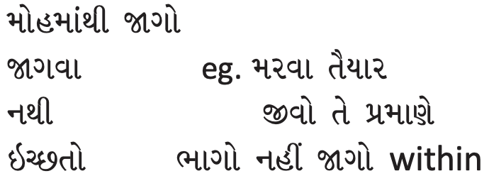

[toc]

# Dropping Wordly Desires (માયિક સુખની વાંછાનો અભાવ)

## Reference

- https://www.youtube.com/watch?v=l1v7YUojwDU

## ઊછળતી રુચિથી શ્રવણ

Param Krupalu Dev wants to make sure that you have reverence to listen to satsang. If you have such admiration, every sentence, every word of the Enlightened One is filled with infinite scriptures, it is auspicious and the supreme cause of liberation. He inspires us to walk on the path of liberation. Someone who is not hungry would not care to have yoghurt  with dry fruits in it. Someone who is not thirsty, won’t be interested in drinking even cold lime juice. Someone who doesn’t have an inner need, even if he comes in contact with the Enlightened One, won’t be influenced. For the one who does not want to wake up, no amount of beating of the drum can help him, he will not wake up. 

If you have the spiritual readiness, only then will the Enlightened One become an instrumental cause or a catalyst. For transformation, not only do you need reverence for the Enlightened One, but you also need a yearning for liberation. One who has no need, will never benefit from any amount of lectures. What is the point of crying in the wilderness? The Enlightened Ones say, “When we preach to those who are not worthy, we feel that we are crying in the wilderness. Even if there are thousands of people listening to the Enlightened One, He feels that He is crying in the wilderness.

- જ્ઞાનીની વાણી નો માહિમા છે? - શુ એ મહિમા સાતે તમે સામબ્ડવાના છો?
- જ્ઞાનીની વાણી - ઉન્નત / મોક્ષ માર્ગની પ્રેરણા આપે છે.
- ગરજવિનાનો જે ચે એને સતપુરુષ / એમની વાણી મળે તોય શૂ? 
- જેને જાગવુ નથી એના કાનોમા ઢોલ પિટવુ તોય શૂ? ન જાગવુ - ઢોલ - ગરજ નથી
- ભોગવૈભવના રસિયાને
  - બેહરા આગળ ઉપદેશ
  - જાગવાની ઇચ્છા નહીં તેને કોન જગાડે
  - અરણ્યરુદન (વણ, forest) જેવું  - If you cry in a forest, no one hears you. If you don’t wish to be awakened, no one can help you. If you wish to be awakened, nimit will come to you - its laws of the nature.
- તારો ઉપાગાનનો સભંદ છે, તને જાગવુ હસે તોજ આ લાભ તશે.
- એકલો સતપુરુષ નો મહિમા એતલે ફક્ત નિમીત. પરીનમન માટે માત્ર સતપુરુષ નો મહિમા નય ચાલે - તારો મહિમા ભી જોશે.

Till you yourself want to wake up, infinite Tirthankars won’t be able to help you in doing so. If you want to awaken, then the catalyst will come automatically, you will not need to wait. This is the law of nature. When the disciple is ready, the teacher appears. If it is not possible to come in person, He will come in your dreams and awaken you. For dreams, you do not need meritorious karma. The Sadguru will put you on the right path in some way or the other. 

If you want to attain self-realisation, you need a heart that is drenched with emotion, interest that is growing in leaps and bounds, overflowing love, and a fountain of inner enthusiasm. This should be the preparation of the spiritual aspirant before listening to satsang.

The attitude of Atmarpit should be: આત્મારતિતની તૈયારી જોય્યે શ્રવન પેલા.

- નીતરતું હ્રદય, છલોછલ પ્રેમ, ઊછળતી રુચિ, અંતરની ઘગશ
- વિભાવનો થાક, સંસારનો કંટાળો

If someone says that there is a cobra there, you will not logically evaluate anything, you will only experience fear, and run away from there. When that person clarifies that there is a photograph of a cobra there, and you hadn’t understood him completely, you feel relieved. The word ‘snake’ or ‘cobra’ scares you, but are you frightened when you hear the word ‘infinite bonding karma’? Are you afraid of binding faith delusion karmas - darshan moha, afraid that it will bind you in jail for ‘70 kodakodi (crore x crore) sagaropam’, or is this a mere mood for you? Are you scared of impurities? The spiritual aspirant is frightened of being trapped in faith delusion and accruing infinite bonding karma.

- સર્પ નામ સાંભળતાં ભય, દર્શનમોહનો ભય

If there is a girl in the family, who is of a marriageable age, her parents are worried about looking for a nice boy and a family for her. They cannot sleep at night. How can the spiritual aspirant who wants to attain self-realisation sleep at night? He is worried that since his inclinations have not yet taken refuge within, what will his future hold in store for him? He has no desire for anything external or any worldly pleasure. All his interest is directed towards knowing his true nature, and he is never lazy when it comes to this. 

- પરિભ્રમણની ચિંતા: દીકરી ઘર - વર ઊંઘ નહીં, સ્વરૂપરૂપી વર - ઘર નિદ્રા નહીં
- સંસાર પ્રિય નહીં, સંજોગોની કામના નહીં, આળસ નહીં, સ્વરૂપવાતનો હર્ષ - ઉત્સાહ

It is alright if you don’t focus on calming your passions, disaffection for transmigration, and compassion for all living beings. Only work on having a heart that is drenched with emotion, ever increasing interest, overflowing, love, and a fountain of inner enthusiasm. In the life that you have, focus on attaining the first samkit (vyavhar samkit). The Guru will never give you the certificate of the first samkit because He knows that the moment you get this certificate, you will be elated. You won’t work towards attaining the second samkit. He might give you the certificate of the second samkit if you are about to leave your mortal body or if He is leaving His mortal body. The Guru does not want your progress to stop or for people to have too many expectations from you. If this were not so, an entire string of obeisance would have begun, first to Param Krupalu Dev, then Pujyashri Saubhagyabhai, Pujyashri Lalluji Muni, Pujyashri Ambalalbhai as they had attained samyag darshan (self-realisation). In this process, the unparallelled devotion would be lost. Prabhu revealed this on the previous day of leaving His  mortal body. Sometimes the Guru may reveal that someone has attained samyag darshan if the person is being disrespected a lot by others. The Guru would never reveal the first samkit, as you would be too happy and would not work for the second samkit. The more you understand the thoughts of the Enlightened One, you won’t feel that He has said something unprecedented, you will feel that it is common sense only. Still, you will feel that He has said something extraordinary. But you did not have this common sense before Patrank-166 began. This is the beauty of the Enlightened One’s words - you don’t need to attribute everything to faith, it all seems like common sense to you. 

The spiritual path is now so clear, that you are bound to find the path logical and experiential. The Enlightened One says, “Each moment you are making mistakes as huge as the Himalayas, because of your false beliefs. You have remained in the darkness of ignorance since time immemorial, but now, please turn, and enter the light. How long will you be engrossed in your dreams? You are experiencing the manifestation of meritorious karma. You have attained the human birth, you have circumstances that are favourable to spiritual upliftment, you have a well - developed intellect, and discrimination; now let your awareness turn towards the soul. If that is not possible, let your modifications turn towards the soul. If that is not possible, let your inclinations turn towards the soul. If that is also not possible, let your love be directed towards the soul. None of your excuses or arguments will help in getting rid of your infinite transmigration. Fall in love with the soul!

- જ્ઞાની ઉપદેશે: પળ પળ હિમાલય જેવશ્રી ભુલ, જુગજુગના અંધારામાંથી બસાર આવ.
- હવે પડખું ફેરવ, સ્વપ્નમાં મસ્ત નહિ રે.
- મહતપૂન્ય નો ઊદય થયો છે, માનવ ભવ છે, પરમાર્ત ને અનુકુળ એવા યોગ છે,  વીવેક શક્તી છે, વીકસીત ભૂધી છે
- આત્માતરફ ઉપયોગ લગાડ, if that is not possible then apply પરિનીતી or વ્રુતી or પ્રીતી

Today we are going to start the satsang with the divine words of Param Krupalu Dev. He has given us unparalleled refuge. On the last day of Paryushan, you will feel that you have studied all the scriptures. 

In Vikram Samvat 1954, Prabhu was in Vaso for 30 days. Pujyashri Lalluji Muni and other ascetics were also there at that time. One day, they asked Prabhu, “If a seeker comes to us, which spiritual practices should we give him so that he may progress on the path?” Prabhu gave them a list consisting of: giving up the seven addictions, giving up seven types of non-edible food, reciting Hey Prabhu! Hey Prabhu!, Yam Niyam, Kshamapna. He gave two mantras at that time: Atam bhavna bhavta jiva lahe kevaljnan re, and Sahajatmaswaroop Paramguru. In the end, Prabhu said, “Every day one must read something, contemplate upon it and commit it to memory.” Prabhu was very clear that you cannot attain any spiritual welfare if you do not give up the seven addictions. The person who goes to prostitutes etc., or consumes alcohol, is not worthy of singing Hey Prabhu! This is His heart. You must commit Patrank-166 to memory as we go ahead in the journey

## માયિક સુખ

“*Without giving up all kinds of desires for illusory pleasures at some time or the other, there is no freedom. So understand that the very moment you hear this statement, you should begin the practice of that course of action*. ”

Many times there is no object of enjoyment in front of you, but you still desire it. (માયિક સુખની વાંછા) E.g. There is no Coke at present, you are not going to drink it during Paryushan, still, you have a desire for Coke. The next sentence is extraordinary “So understand that the very moment you hear this statement, you should begin the practice of that course of action.” 

**Illusory pleasures (Mayik sukh) and the desire to indulge in them**: Mayik comes from the word maya - created by illusion. A magician makes you see something that actually does not exist. Illusory pleasures also do not exist but you feel like they do. There is an illusion of happiness in mayik sukh. It is projected happiness. It is not real. Worldly pleasures and desires for the objects of the five senses give you the illusion of happiness, but that is not real happiness. 

You have the desire to experience whatever you like. Whatever you dislike, you are disturbed by it and you want to get rid of it. E.g. If you have fever, you won’t like the A.C. in the room, so you will be disturbed by it. If you are well and want the A.C. to be more powerful, you will desire it. This is what you do the entire day – either you are delighted or disturbed and as a result you boost your ego or otherwise. A fish in the fish tank is doing no more than you or you are not doing anything more than a fish. You might be engaging in satsang etc., but you keep experiencing desires and disturbance. 

You think that you will get happiness from an object, you think that if you have it, you will be happy, so you desire it. However, there is not a single person who has experienced contentment through the fulfilment of sensory pleasures, and there are several who have become tired of sensory pleasures. E.g. You say, “I worked very hard all these years, I woke up at 5 am and went to the office. Now I am tired and I want to retire.” You get tired of sleeping also. You get tired of sitting, then you want to walk. That which tires you or which you get bored of, how can that be the source of happiness? How can you be fed up with something that gives you happiness? Bhagwan Rushabhdev is not tired of the bliss and happiness of the soul since billions of years. You get tired of happiness because worldly things do not give you true happiness. 

Let’s say you were very thirsty and had an entire jug of water; not a drop has gone into your soul. Not even a bit of food has entered your soul. How can you be happy? None of the sensory objects can gain entry in the soul. You are tired of enjoying sensual pleasures but nothing actually enters the soul. 

Illusory happiness is a projection, imagination, it is an attraction. You only project something, and you get attracted by that projection. A youngster went to Pujya Gurudevshri and said, “Bapa, she is beautiful, that’s why I am so attracted to her.” Pujya Gurudevshri said, “You forgot one step. You are under the influence of delusion, so she appears beautiful to you, so you got attracted to her.” 

Nowadays the fashion is to grow cacti in the house. People do not grow roses anymore. They find the cactus more beautiful than the rose. What is more beautiful? Because you are under the influence of delusion, it appears beautiful to you. Under the influence of delusion, your connection with the soul and the Lord weakens, therefore you start noticing that object, you feel it matches your concept of beauty and then you desire it. Your happiness is conceptual and not actual. Whatever is conceptual is illusory. Whatever is actual is spiritual. 

If you see a rope in the dark and feel that it is a snake, you experience fear within. Similarly once your concepts are formed and projected, then you experience craving. Whether it is fear or craving, both are impurities only.

There is a screen and there is a projection of a film on that screen. You cry when the lead actress faces miseries. But then you realise that you are getting late to go somewhere and the film is not real; reality is that you have to leave. If you think that the film is real, you will experience joy or sorrow. If you realise that the film is false, you will be at peace. Just focus on the screen. If you are an actor in a drama even if your wife is kidnapped, you will have a cup of coffee in the green room. If you think that it is real, you will get either angry or cry when your wife is kidnapped.

If you think of the illusory as real, you will experience impurity within. The moment you realise that it is false, you won’t be affected. Your problem is you think that the illusion is real. Just fast forward your life and see yourself on your deathbed. When you evaluate your life at that time, you will feel that you lived a worthless life. Everything seems false and worthless. You will realise that nobody is going to go with you. If there is a death in the family, for two months, you should only have thoughts of embracing initiation. 

If someone is able to immediately propose new business initiatives, liberation is very far for him. He should realise that everything is temporary, false, and trivial. The person who died, has only taken along the refuge of the Enlightened One and the purity attained through bhakti, nothing else. The drama has ended. You will never meet this husband or son again. You harboured desires for these trivial things all your life! Param Krupalu Dev’s refuge will take you to the gateway of liberation. You put everything at stake for the illusory, and lost it all. You never sought true happiness. You did not accomplish that which you were born to do.

The Enlightened One is telling you, “Awaken from this false perception!” A hungry beggar dreamt that he was a king. In his dream, he saw that he had the best cuisines in front of him. He ate all the sweets in his dream. Ten years of begging could not break the notion of these ten minutes of kingship. His dream appeared so real that his reality of 10 years of being a beggar could not shatter it. He enjoyed being a king in his dream. When he woke up, he realised the truth. 

Just now your dream is so attractive - you feel that you have a lot of meritorious karma, you are happy, you do not even want liberation. This is false but the experience is so strong that even reality is not breaking your dream. You will need someone to awaken you. You may not like it when someone has to smack you to wake you up, but once you are awake, you will be indebted to Him for life. 

Someone said to Pujya Gurudevshri, “I love Your talks, I am ready to die for You.” Pujya Gurudevshri said, “Do not die, just live according to what I have said. Awaken.” Your ego is boosted by your projection. You feel it is beneficial. E.g. I am a father, I am a successful businessman, etc. These are your projections, which feed your ego, your false sense of self. When someone dies in the family, you actually keep a note of who came to offer condolences and who did not. You are not crying because you lost a loved one, you want to encash respect. You feel illusory happiness benefits your ego and you enjoy that, so you are not waking up. The Sadguru encourages you to awaken. If you realise what your next birth will be, it will send shivers down your spine. Awaken!

If your knowledge is saying that coffee or fritters give you happiness, you start desiring the same. If you work on your desires directly, you will do nothing but suppress them. You have to work on your knowledge, that made a statement that happiness lies in coffee and fritters. You have to cut down on the scope of these desires. Once you work on your knowledge, there may be objects in front of you, but you will not have any desire for them. 

You come in contact with objects of pleasure due to the fruition of meritorious karma, not on account of your thoughts. The manifestation of karmas is the cause of all external events. You are not the doer, you are a knower and seer. When your thoughts and the karmic manifestation tally with each other, you become egoistic. If everything was happening as per your thoughts, you would have been the richest person on the earth, but that was not part of your karmic manifestations, so it did not materialise. As it is, your circumstances are not caused by your current thoughts, nothing is in your hands. Despite fewer objects, you will be more attached to the few things that you do have. If you have decided to eat only four items for lunch, you will have those four things thrice, as you like those four things now. You can satisfy your taste buds in just two items. Some youngsters say, “I will have only one thing - pizza.” People make sizzlers when there is only 1 item to be eaten. If your belief is wrong, no matter what you do - it will not be correct. Unless you understand the order of the path, even if you embrace renunciation, you will not progress spiritually. If these pleasures of the five senses do not actually give happiness, why does one experience happiness when indulging in them? This is because of ignorance and delusion, you imagine that there is happiness in those things. Because of your imagination, you desire them. Until the desire is fulfilled, you experience misery, displeasure and agony. Then you try to acquire the desired object, and your desire is fulfilled. So your misery ends. Now that there is no more misery and agony, you call that happiness. You only call the absence of misery, happiness. Your restlessness and anxiety have gone, that is what you are referring to as happiness. Let’s understand this with two examples. You have an itch. Your first desire is to scratch, but the doctor has advised you not to scratch at any itch. You feel misery, discomfort, agony, anxiety, etc. Finally, you scratch the itch and experience some relief and label it as happiness. Actually, only your anxiety has gone. Let’s take another example. There is someone who has no itch at all, so is he happy or unhappy? Your earlier conclusion was that scratching leads to happiness. Now who is happy? The person in the first example or the second? In the first example, there was a desire to enjoy sensual pleasures and in the second example, there was no desire for sensual pleasures. So the second person is truly happy. Pujya Gurudevshri has to eat 19 tablets in a day. With these tablets, His pressure and sugar remain normal, He feels nice and healthy. Nemiji does not need to take a single tablet. Now, who is healthy? One who does not need any tablets is healthy. One who takes medicine has only solved the problem. He has just gotten rid of his miseries, how can he be considered as happy or healthy? Even if he speaks to someone, he will have to say that he suffers from hypertension. He cannot say that he is in the pink of health. So, who would be considered happy? When you are hungry, you love food to rid yourself of the misery of hunger. When you are not hungry, you may not find food just as tasty. And once your hunger is satisfied, you may not even like the same food. When lust arises, a woman seems very attractive to you. You feel like she will give you great pleasure, however if she is not interested in engaging with you at that time, then how much joy will this give her? How can you call all these things happiness? This is illusory happiness. Without giving up all desires for illusory pleasures at some time or the other, there is no freedom. So long as you harbour these attachments, desires, and impurities, self-realisation is not possible.

Till you are able to look at a woman, and remain unaffected and experience a blankness within, till the sight of food does not give rise to likes or dislikes, but only blankness, your Guru will not be pleased with you, nor will you experience the soul. The Guru’s approval is a pilot car that selfrealisation is not far away. Without giving up all kinds of desires for illusory pleasures at some time or the other, there is no freedom. You have to give up desire for illusory happiness at some time or the other. You can do it today or after 100 years. You have many desires and you resist them. You spend a considerable amount of time in that fight. Finally, you give in and you enjoy them. Then you go into guilt for having done that and before you know it, a month has passed. Similarly the year and your youth also go by. Once you understand and realise this, you have only one feeling, ‘I want to get rid of the desire for illusory happiness.’ It is obvious to have this feeling. Pujyashri Lalluji Muni told Prabhu in Vikram Samvat 1946 around the time of Diwali, “Prabhu, please give me steadfastness in brahmacharya.” He had not studied the course of action. We have already got that guidance. If you are putting in the right effort, you can attain self-realisation in half the time as Pujyashri Lalluji Muni took. You should have the feeling that you want to get rid of the desire for illusory happiness. Just pray, “Oh Prabhu! I am entangled in the cycles of transmigration. I indulge in worldly pleasures, which are like faeces. In this birth, I have an opportunity to put in the right effort because of You and I want to get rid of all the desires for illusory happiness.” You should realise that fasting for eight days will not help you, but getting rid of your desires will help. While fasting also, you have hundreds of desires, ‘I will eat this and won’t eat that.’ Prabhu is saying, “You should not have desires for illusory happiness.” You give up things in no time; that does not require you to change your beliefs. But belief-changing is what needs to be done. You give up things but increase your ego. “Lahyu swaroopa na vruttinu, grahyu vrat abhiman.”- You do not recognise the bent of your tendencies and get pride in observing restraints. You are in a mess. Your worldly endeavors are going on well because of meritorious karma, but your understanding of dharma is in a mess. Your spiritual pursuits are in a mess.

## વાંછાનો અભાવ

## જ્યારથી શ્રવણ - ત્યારથી ક્રમનનો અભ્યાસ

## ત્યાગની ધાંધલ નહીં