[toc]

# The Essence of the Letter

## Patraank 166 (5 Lines)

Every sentence, every word of an Enlightened One is filled with infinite scriptures, how can this be? With endorsement from countless Enlightened Ones, I consider the statements below auspicious and the supreme cause of liberation for every single aspirant:-

1. Without giving up all kinds of desires for illusory pleasures at sometime or the other, there is no freedom. So understand that the very moment you hear this statement, you should begin the practise of that course of action.
2. By any means, search for an Enlightened Master. Having found Him, cultivate an attitude of surrender unto Him through body, mind, speech and soul. Follow only His commands in every way, without any doubts. And realise that then alone can there be complete annihilation of all illusory passions.
3. Through beginningless cycles of birth and death, you have heard the scriptures infinite times, you have pursued knowledge infinite times, you have taken complete renunciation infinite times, you have attained the position of Head of the congregation infinite times. Nevertheless, you have not found the Truth, not heard the Truth, nor had faith in the Truth. And upon your meeting it, hearing it and having faith in it alone will the yearning for liberation resonate from the Soul.
4. The path to liberation is not outside but within the Soul. The One who has attained the path shall help attain it.
5. The path is contained in two letters and yet, since time immemorial, after putting in so much effort, why has it not been attained? Deliberate upon this.

## સમ્યગ્દર્શનનો મહિમા

==મનુષ્યપણુ દુર્લભ, સમ્યગ્દરશન અનંતું દુર્લભ==

The human birth is very rare, but infinite times more rare is samyak darshan (self-realisation), because you have been born as a human being infinite times, yet, without attaining samyak darshan (self-realisation), despite having the precious human birth, you wander in cycles of birth and death. 

==સમ્યગ્દરશન પ્રાપ્ત તો જીવ આવશ્ય મોક્ષ પામે==

However, once you attain samyak darshan, this wandering comes to an end. You will definitely attain liberation. The time period may vary; if one has kshayik samkit (when all the karma of faith delusion are annihilated) he will be liberated in a maximum of 3 births; one with shraddha samkit will have a maximum of 15 births,but no matter what, attaining samyag darshan is a guarantee that liberation will soon follow. Being born as a human being does not guarantee liberation, but samyak darshan does. 

==દુર્લભ મનુષ્યજીવનનું મહાકર્તવ્ય==

Therefore, as a human, your most important duty is to attain samyak darshan, which is your advance booking in moksh! You will have reserved your seat in moksh! Once your seat is reserved, you start running full speed on the path of liberation. Having attained samyak darshan, one cannot bear not having the state of complete purity so his efforts gain speed and momentum.

==દુર્લભ છતાં અશક્ય નહીં==

Acharyashri Kundakundadev wrote in the 154th stanza of ‘Niyamsaar’, He called this fifth era ==પંચમકાળ== ‘extremely inauspicious times (==દગ્ધ અકાળ==)’. Why did He say this? Because one cannot attain omniscience (==કેવળજ્ઞાન==) in the fifth era (==કેવળજ્ઞાન અપેક્ષાયે==). 

==સમ્યગ્દર્શન માટે સુકાળ છે, ઉત્તમ કાળ છે==

But to attain samyak darshan, it is an auspicious time, it is a priceless opportunity. The aspirant’s enthusiasm is such that once he has found the right path to follow, he feels he has attained samyak darshan itself. There are approximately 18,500 years left for the 5th era to end. During this time, it is possible for one to attain the 7th gunsthanak (14 stages of spiritual development). This means it is possible to attain samyak darshan along with samyak charitra (right conduct). The seventh gunsthanak is Apramatta virti or apramatta sanyam (perfect observance of vows).

==ચારિત્ર નહિ તો સમ્યગ્દર્શન==

If you can attain samyak darshan and samyag charitra both, that will be the best. But if you cannot attain samyak charitra, then at least attain samyag darshan. At least your infinite transmigration will be stopped. Acharyashri Kundkund says, “*Oh, Soul! Do not become weak* (==શિથિલ નહી==) *in attaining your samyak darshan*.”

> There are internal factors and external factors that contribute to attaining samyak darshan. 

==અંતરંગ==

- નિમિત્ત
- મિથ્યાત્વનો, ઉપશમ-શયોપશમ નો શય

The internal factor is the subsidence (or part), destruction (or part)  of mithyatva - false beliefs. 

- If there is subsidence, that leads to upsham samkit
- Part subsidence and part destruction of false beliefs leads to kshayopshamik samkit and complete destruction of mithyatva
- False belief leads to kshayik samkit. WIthout this, it will not be attained. 

==બહિરંગ==

- તીર્થંકર ની વેદના
- જ્ઞાની ના શાસ્ત્ર
- જાતિસ્મરણ ભક્તિ

The external catalysts are sermons of Tirthankar Bhagwan, the discourses of the Enlightened One, listening to the scriptures, jatismaran jnan (memory of past lives), awareness, in the wake of intense pain, great enthusiasm during bhakti, etc. 

> The strongest catalysts are the sermons of Tirthankar Bhagwan and the discourses of the Enlightened One, however history also speaks of incidents where one has been very aware in the wake of severe pain and experienced that he is distinct from the body.

==શુદ્ધાત્માની અનુભવ સહિત પ્રતીતિ==

==નિશ્રય  સમકિત==

What is samyak darshan? It is the experience of the soul, where one is in a state of thoughtlessness. When someone has the experience of the Pure Soul with conviction, that is called samyak darshan. 

==આાત્માનું નિર્વિકલ્પ સ્વસંવેદન==

- આાત્મસ્વરૂપ જણાય
- શાંતિનું વેદન
- પછી વિકલ્પ વખતે પણ જુધ્દ
- સ્વરૂપપ્રતીતિ રહે

We are talking from the nishchay samkit point of view. When we only speak about the actual experience, darshan (faith), jnan (knowledge), and charitra (conduct) are included. But once he comes back to the thoughtful state, whatever conviction remains, that is nishchay samkit. Here the soul realises the true nature of the self and feels peaceful. After this, even when he returns to the state of thoughtfulness, the true nature of the self is not forgotten, that conviction remains with him.

==આનંદરસનો સ્વાદ==

==સુખરસના દરિયામાં ડુબે==

==દુ:ખ દરિદ્રતાનું નામોનિશાન નહીં==

The person is not the same as before. The conviction of the soul remains. 

👉 Just as a wife is always, ‘Mrs’ even if she is not physically with her husband. That relation remains always. So also, even if the person is not experiencing the soul at present, the aim and conviction of that experience remain. He will now always be called a realised person, just as the wife is ‘Mrs’ though she is away from her husband. He remains in a state of bliss. He has no miseries or helplessness.

==સમકિતરૂપ શ્રાવણ માસ આવતાં==

- મોહની ગ્રીષ્મ ત્રતુનો ઉકળાટ
- સ્વાનુભવરૂપી વીજળી ઝબકારા
- શાંતરસની વર્ષા ધનધોર
- આત્મામાં ધર્મનું ચોમાસું બેઠું
- ચૈતન્ય આનંદના ફુવારા
- અગ્નિ બુઝાય વર્ષા થિ

Self-realisation, samyak darshan is like the monsoon - samkit sawan. The monsoons dispel the summer heat, similarly one with samyak darshan is free from the heat of passions and desires for sensual pleasures. Once the lightening of self-experience strikes, there is a flow of inner peace. It is as if the monsoon of dharma sets in. There is peace and calm, as well as the experience of a fountain of bliss within. That’s why samyak darshan is compared with the month of Shravan which brings the monsoon. It comes after Gurupurnima (Ashadh poonam), signifying that samyak darshan can occur only after you gain the Guru’s rajipo.

- હિત સાધવાનો અવસર - સળગતાં સુકાં વન સંસારથી છુટવા
- ચૈતન્ય ગગન શાંત જળની મેઘઘારા વરસાવે

The Enlightened Ones say that it is time to attain spiritual welfare. The world is like a dry, burning forest. Put in the right effort to free yourself from the forest and be drenched in a soothing downpour of rain. Work towards attaining samyag darshan. When an earthquake of a high magnitude strikes, you drop everything and run outside, similarly, 

- શીધ્ર પુરુષાર્થ કર
- સળગતાં ઘરમાંથી નીકળ જેમ તેમ સંસારદાવાનળ

‘Oh soul! Leave aside everything else, and work towards attaining samyak darshan immediately.’

There is a 5 step process to attain samyak darshan.

1. Be a true aspirant: Develop the necessary worthiness and eligibility.
2. Association with a Sadguru: The search and surrendership.
3. Tattva nirnay: Determination of the Fundamental Truths, receiving the Sadguru’s teachings on the fundamental truths and putting them into practice
4. Connection with the soul: bhed vijnan (Discriminating between the self and the non-self), inward focus.
5. Experience of Thoughtlessness (nirvikalp anubhuti):

Since Pujya Gurudevshri has begun giving discourses, He chooses from these 5 topics alone. He has not spoken about anything else but this. At the most, He has spoken on the state of the Enlightened One, which is included in the fifth step only. Vachanamrutji has these five topics only, there is no sixth!

Just experience the soul for a second and enjoy the bliss. Experience yourself for just one second. Just ask for this small experience from the Lord, but He is so compassionate that He books a place for you in moksha.

> The above five steps are the five statements of Patrank-166. This patrank shows the method of attaining samyak darshan. What we spoke of during this Paryushan were the five steps of attaining samyag darshan.

## આત્માર્થીપણુ

### Five Steps of attaining Samyag Darshan

**1. Be a true aspirant:**

There are two types of poor people. 

- One set of poor people are used to their poverty. They have come to terms with their poor condition and have learnt to live with it. They know that they have only limited things, etc. 
- The other set of poor people are those who hate their poverty, it pricks them and they keep seeing dreams of becoming rich day in and day out. They even make an effort to become rich, irrespective of whether or not they succeed. 

Before India had freedom in 1947, Indians were the slaves of British. There were two types of slaves. 

- One type was used to this slavery and did not even feel that it was insulting. To see a board with the words, ‘Dogs and Indians are not allowed,’ did not even seem like an insult or something to feel bad about. 
- The other type of slaves felt that it was extremely insulting. All the freedom fighters came under this category. They kept working towards freedom and they were eager to gain independence.

==બે  પ્રકારના અજ્ઞાની:==  There  are two types of ignorant souls. 

- ==સંતુષ્ટ સમાધાન:== Those who are happy and content with the fruition of the meritorious karma – whatever material conveniences and sensual pleasures they have. And they have come to terms with their miseries. They have accepted their miseries. ‘My daughter-in- law makes me miserable or my mother-in-law makes me miserable.’ You have accepted that you are miserable, and you are sure that this misery comes from outside.

- ==તરવાનો કામી દિશા નિર્ણય:== 

  ====
  He decides the direction in which he wants to go. He wants to swim away from the ocean of transmigration. He does not want to go in the direction of illusory happiness. He goes towards spiritual happiness. He has not started walking, but his direction is decided. He wants to attain liberation.

**Eligibility of true aspirant:**

==આત્માનુભુતિ ઝંખનારની==

==યોગ્યતા તૈયારી, લક્ષણો કેવા હોય?==

What eligibility is expected of one who is longing for self-realisation? What should his eligibility and worthiness be? You must have 4 qualities to be a true aspirant to be a spiritual aspirant, worthy of attaining self-realisation. ==આવો જીવ મોક્ષમાર્ગનો જિજ્ઞાસુ સમ્યગ્દર્શનનો અધિકારી છે==

1. **Kashayni upshamtata** – subsiding of passions. ==મોળા, ક્ષમાદિ ઉત્પન્ન, ચિત્તશુધ્દિ==
2. **Matra moksh abhilash** – Only the desire to be liberated ==સંસારના ભોગ વાંછા નહીં, છુટવાની, નિજશુધ્દિની વાંછા રહે==
3. **Bhavey khed** – disaffection for transmigration. ==પરિભ્રમણનો વિભાવભાવનો થાક, વાસનાનો ગભરાટ અરેરાટ==
4. **Anukampa** – antar daya – compassion. ==જગતને રૂડું નહી, પરિભ્રમનથી છૂટવું છે, બંધનથી મુક્ત અનુકંપા==

👉 ==હોંસ, દીકરીના લગ્નમાં બાપને ખુમારી પ્રેમ દુનિયા દરકાર નહિં==

When a daughter is getting married, the father is very zealous and enthusiastic. He does not care about the world. He personally distributes invitation cards, makes the best food etc. The seeker too is zealous and enthusiastic. He only wants satsang, let the world say whatever it likes.

👉 Juthabhai’s wife Ugriben was asked not to do satsang with Ambalalbhai after Juthabhai left his mortal body, she clearly said, “I will shave off my head, I will wear red clothes, but I won’t leave satsang.”

👉 ==કંટાળો નહીં, યાત્રામાં જવાનો નથી==

==પુનરાવર્તન કરવું નથી, પુનરાવર્તન લાગતું નથી==

If you are travelling somewhere, you keep discussing your plans with other people who are accompanying you. After coming back from the trip, again you have the same discussions. You enjoy these discussions. But someone who was not on the trip, will get bored and tired. In the same way, whenever you feel that there is a repetition in satsang, you are not eligible for the journey of liberation. Those who do not want to repeat the cycles of transmigration, they should love the repetition and revision in satsang. The Enlightened One is checking you with a thermometer when He is repeating something. Those who feel that there is no repetition, who enjoy it each time, he is definitely on the journey with the Sadguru. The moment you feel boredom, you are not ready for this journey.

==દિશાનો નિર્ણય, છુટવાની ભાવના==  The moment you want to get liberated, you have to start practising the course of action, as Prabhu has said in Patrank-166.

**Kashayni upshamtata:**

The passions become weak. The passions should decrease not only in intensity but also in category. Such a person no longer experiences any infinite-bonding karma, not even for a second. The intensity of passions reduces, for example, he becomes much less violent or angry. If there is even a momentary feeling or thought or word that is in opposition to the Truth – the Enlightened One, that is considered as intense passions, even if he gets angry only once a year.

Param Krupalu Dev (Prabhu) was very strict and particular about reverence and humbleness. In Wadhvan Camp, Popatbhai Mohakamchand said something that showed lack of devotion, and Prabhu asked him to pack his bags and go back to Ahmedabad. Then with the request of Pujyashri Ambalalbhai, Prabhu allowed him to stay.

The passions should not only change in the intensity, but now category should also change and you should not say a single word against the Enlightened One, the soul, or the scriptures. If you say that the Enlightened One or the scriptures scare you unnecessarily, then your passions have not become weak. How can you question and challenge the Enlightened One, when you are not even in nursery on the spiritual path and He is a connoisseur on the path.

You should have developed the virtues of forgiveness, humility, softness, etc. to a certain extent. You realise that you were angry, but then you feel sorry too. You did atone, but Do not let these virtues become weak. There is also inner purity. To summarise: A difference in category and intensity, developing virtues and inner purity.

**Matra moksh abhilash and Bhavey khed:**

Liberation is the only aspiration: Now you do not talk about any illusory pleasures. Prabhu is talking about this in Patrank-166 in the first statement.
“*Without giving up all kinds of desires for illusory pleasures at some time or the other, there is no freedom. So understand that the very moment you hear this statement, you should begin the practice of that course of action.*” This includes matra moksha abhilash and bhavey khed, Prabhu spoke about the true seeker. When you feel compassion for the soul, all the above virtues will arise automatically. Prabhu had great clarity.

Prabhu did not speak about five steps of samyag darshan, but still, He gave Pujyashri Saubhagyabhai the whole method in the five steps and attain nishchay samkit. Saubhagyabhai attained samyag darshan and left his mortal body.

**Bhave khed:**

You should be tired of your transmigration now. You should be tired of your impurities. You are fearful. If you have desires for illusory happiness again and again, when they are not fulfilled, you get angry. If they are fulfilled, you feel proud. You are tired of making mistakes. ‘Oh, Lord! This time when I am appreciated, may I only remember Your grace and not become egoistic.’ The seeker is uneasy and fearful of becoming egoistic or getting angry. The seeker is scared of his impurities, he is not scared of people or situations.

Prabhu wrote ==Patrank- 37== to Juthabhai Ujamshi (Satyaparayan- truth aspiring), Juthabhai was false for the world, but on the path of liberation, he was true and sincere. In Patrank- 37, Prabhu wrote to Juthabhai, “*Infinite attempts to look good in the eyes of the world have not accrued any benefit, because traversing through life-cycles and its cause is still present. One birth spend towards the upliftment of the soul, will compensate for infinite life- cycles, this is my humble understanding and all my activities are aimed towards this*.” The seeker does not want to please the world, he wants to attain liberation. This is the eligibility of one who wants samyag darshan.

## સદ્દગુરુની પ્રાપ્તિ

==આવશ્યકતા - શોધ અર્પણ==

Association with a Sadguru: You need to search for a Sadguru and surrender to Him. The aspirant only wishes to attain self-realisation. Who can help him? Only one who is self-realised will be able to help him. If you want something, you can get it only from someone who has it. His academic qualifications, whether He is an ascetic or not, or whether He belongs to your sect or not is immaterial. Focus on self-realisation. If someone from your sect or your family Guru has self-realisation, then by all means follow Him. He may or may not give the best discourse. Self-realisation is the only criteria for associating with the Sadguru.

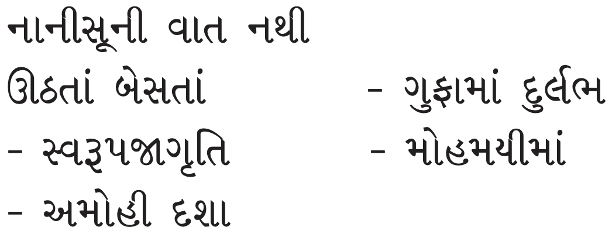

Do not think that the lions cannot be found in a crowd of people. In the samavasaran, there were thousands of people, and dharma prevailed. Sometimes a person might be living in a cave and not be self-realised. Let self-realisation be your only criteria to find your Sadguru.

==માર્ગદર્શન + સત્ય પુરુષાર્થથી==

==તાળુ ખોલવા ચાવી==

Once you have the dire need to find a self-realised Sadguru, then you will start searching in the right direction. If a door is locked, can I fast for 10 days, donate money, follow certain disciplines and vows or read scriptures to open the door? No. But if I get the key from someone then I can open the door. Similarly, be clear that if you want to attain self-realisation, the right guidance etc., will be given only by the Enlightened One. When you search for the Enlightened One, you attain Him.

==પરિણામને આધાર, દ્રષ્ટથી અદ્રષ્ટ સુધી==

==પરમાં, આત્મા માટે સજીવનમૂર્તિ==

“Atmajnan tyan munipanu, te saachaa Guru hoy, baaki kulguru kalpana, aatmarthi nahin joy.” - Monasticism abide in self-realisation, they are the true Gurus, a truth-seeker who does not have any fancy about the family priests. “Pratyaksha Sadguru praaptino, gane param upakar, trane yoga ekatvathi, varte ajnadhaar.”Considering the direct access to a true Guru as a supremely beneficial one, the seeker realises that he will get rid of his flaws and faults. So the seeker acts on his percepts with the united energy of all the three faculties (body, speech, and mind). “Ema vichaari antare, shodhe Sadguru yoga, kaam ek atmarthnu, bijo nahin manarog.”- Thinking as such, one seeks access to a true Guru, self-realisation is the only aspiration, his mind knows no other ailment.

==આવશ્યકતા - નિર્ધાર, સજીવનમૂર્તિના લક્ષ, વિના બધું નિષ્કળ==

==આત્મજ્ઞાની જ બતાવી શકે==

Thoughts and feelings need the support of either an external substance or the Pure Nature. You have decided that you do not want to take the support of external factors, you only want to give the support of the true nature to your thoughts and feelings. But the problem is the true nature is not something that is visible. You realise that at the present moment, you cannot see it, your senses are active just now. You are not able to go beyond the senses. You need to take the support of some external factor. So you take the support of someone who is external, but still, is established within. Give your thoughts and feelings the support of the Sadguru’s love and bhakti. Now do not get involved in sensual pleasures. Just get involved in the bhakti of the Enlightened One.

Without a living Master, everything is worthless. You will need a living Master, you will have an intense desire and need for the same, so you will search for Him and find Him. When you associate with Sadguru, act as per His commands and surrender body mind and speech.

### આત્મજ્ઞાની જોઇએ

In the second statement of Patrank-166, Prabhu has said, “2. By any means, search for an Enlightened Master. Having found Him, cultivate an attitude of surrender unto Him through body, mind, speech, and soul. Follow only His commands in every way, without any doubts. And realise that then alone can there be the complete annihilation of all illusory passions.” This is the second step to attain samyag darshan.

The path to attain moksha is called dharma. Acharang Sutra clearly says, “Anae dhammo” Following His ajna is dharma. When Prabhu has said, “The path is contained in two syllables,” it has to be nothing but His ajna.

👉 ==આજ્ઞા પ્રમાણે વર્તવું છે, મા, બાળક, એકડો== Once the seeker finds his living Master, the Enlightened One, he wants to live in His ajna. He becomes like a child, who tells his mother that he cannot write. So the mother holds his hand and makes him practice writing. In the same way, the seeker surrenders his mind, speech, and body, and he wants the Enlightened One to guide him such that he turns towards soul. He surrenders at His Lotus Feet with a lot of love. The seeker knows that he knows nothing and everything that he has done so far is worthless. With this surrendership, he asks for an ajna and He gives him the ajna. Then he attains Gurugam (knowledge from the Guru). There is no welfare without Gurugam. You will attain the knowledge of incomprehensible only through Gurugam.

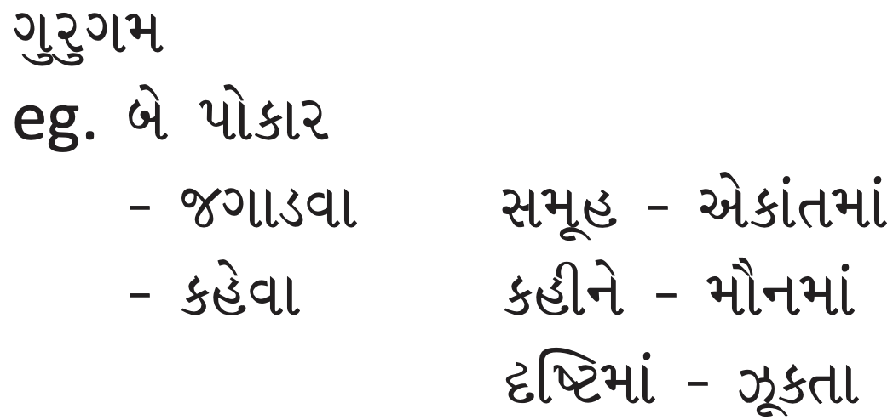

What is Gurugam? If you are sleeping and the Guru wants to say something to you, He will first wake you up. Once you are able to receive His message, He will convey it. This conveying of the message is Gurugam. Awakening you is the first step. To awaken you, He will talk about dispassion, rarity of human birth etc., but that is not the actual message. Having awakened, He will reveal the special path of practice carved out for you, depending on your interest, liking, potential, circumstances, etc. This special message is Gurugam.

When does the Guru give Gurugam? Sometimes He gives it in solitude. Pujyashri Ambalalbhai received it in the Aga Khan Palace in Vikram Samvat 1957, and he attained samyag darshan. Sometimes the Guru just looks at someone, even in the midst of a gathering and bestows Gurugam. Sometimes He speaks and sometimes He remains silent. Sometimes when the disciple is bowing down to Guru, he receives Gurugam. Swami Vivekananda received it through the touch of Ramkrishna Paramhansa’s Lotus Feet. What will happen with you is not fixed, but He is very creative and romantic. He keeps creating different methods give Gurugam. Leave it to Him to decide how you will receive it.

Prabhu spoke about Gurugam in Vikram Samvat 1947 when He composed ‘Bina nayan pave nahi’ in Mumbai. Emotionally speaking, this composition can awaken even a dead person! It is so powerful, meaning if you are falling spiritually, it can uplift you. Once you receive Gurugam, something happens within and the next moment, you feel that you are in a different state. You feel that you have effortless constant connection. Then Guru may give some external spiritual pursuit. Pujyashri Lalluji Muni was asked to chant five rosaries of ‘Sahajatmaswaroop Paramguru’ every day, and attained samyag darshan. But the power behind the mantra is that of the one who sent it. For example, the Guru awakens you with a stick. When you wake up, you see the stick first and think that the stick woke you up. No, the one holding the stick awakened you! It is not scriptures, rosaries, mantra, situation, or method of spiritual pursuit that should receive credit. They are all external means. The power and strength in them comes from the One who prescribed them. It is the power of the Enlightened One. If He has asked you to go to the temple every day, you will attain self- realisation from that too.

## તત્ત્વબોધ અભ્યાસ, તત્ત્વનિર્ણય

Tattva nirnay: Determination of the Fundamental Truth: Once you meet the Sadguru, you surrender to Him with love and conviction. Since you like Him, you will like His teachings and His inner state too, and the reason for that state is His being established in the soul. So, you will like the soul also. In the beginning, you will love to listen to Him. Then you will like His state. Then you will like the soul. It is so easy.

To fall in love with the Enlightened One is also a huge milestone. Otherwise, even if you attend the satsang regularly, you are going only for entertainment. You love Him and have faith in Him. He will only help in attaining spiritual welfare. You should listen to Him with this feeling. In the third state, you have to listen to the Enlightened One, put His words in practice, and then you determine the truth. If you do not do this much, whatever you have done since infinity, everything is useless. If you do this with the aim of attaining the soul, you will be successful.

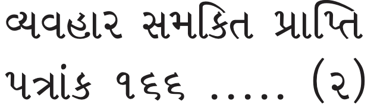

The same thing is said in the third statement of Patrank-166. “3. Through beginningless cycles of birth and death, you have heard the scriptures infinite times, you have pursued knowledge infinite times, you have taken complete renunciation infinite times, you have attained the position of Head of the congregation infinite times. Nevertheless, you have not found the Truth, not heard the Truth, nor had faith in the Truth. And upon your meeting it, hearing it and having faith in it alone will the yearning for liberation resonate from the Soul.”

You just have to change the direction. None of the right means are negated. You have to continue practising the right means as per the ajna of the Sadguru. Keep listening to the Sadguru, contemplate upon the teachings and through that determine the Fundamental Truths. He will give you the keys of how to annihilate faith delusion. Under the influence of faith delusion, the soul’s strength and power reduce to a great extent. It paralyzes your faith and understanding. How can such a soul get up and have the courage to win over it? You need to know the subtle keys of overcoming it. You have no strength and power because of anger or guilt. If you have gone through faith delusion, you will understand this properly. You either have the feeling of opposition or guilt. When faith delusion is strong, you do not even feel that you are wrong. When it is weak, you know that you are trapped, but you cannot stop it or free yourself. The tricks of how to fool faith delusion will be taught by the Sadguru. If you understand and catch those tricks, your path will become clear.

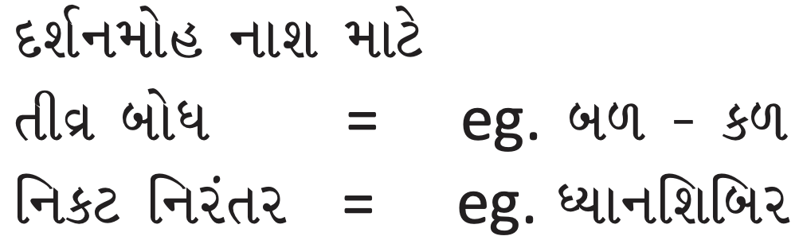

If your only aim is to spend your time well, understanding the preaching superficially is alright. But if you want to annihilate faith delusion, you need to know the subtle tricks. Prabhu says, “To annihilate faith delusion, you constant close and deep association with Sadguru. You should contemplate upon the scriptures of the Dispassionate One. You should have a strong desire to develop virtues within.”

👉 There was a meditation retreat for a month in Mount Abu. It was well advertised. On the 31st day, they were going to take everyone for trekking in the nearby place, which had jungles. The meditation shibir got over, it went well and people were happy. On the last day, they were taken to the jungle for a night safari. Everyone kept awake but they could not spot a single animal. In the morning, everyone got down. Someone said that there is a saint nearby, whoever wanted to do His darshan, you can do so. Everyone went to do the darshan of the saint. They told Him about their last night’s experience. The saint smiled. He said, “There are many cheetahs, panthers, etc. here. But if you want to see them, you should stay here for a long time.”

If you want to attain self-realisation, you should have a close and deep and constant association with Sadguru, to understand His subtle teachings.

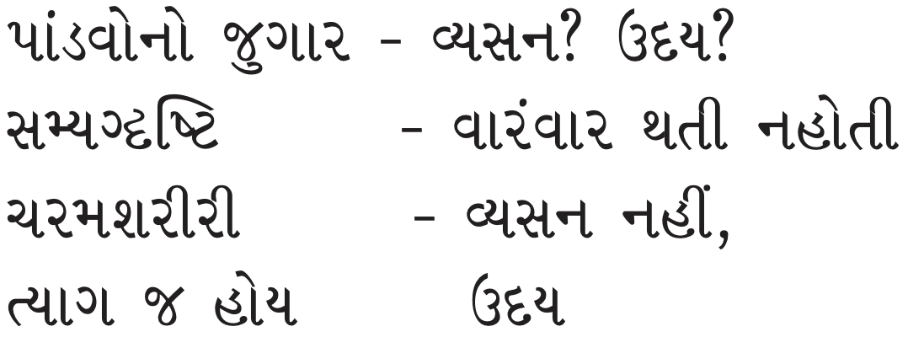

👉 When the Pandavas gambled, was it an addiction which was forbidden or was it the fruition of their past karma that they had to undergo? The scriptures say that all the Pandavas were samyag drashti souls. As per the Shwetambar tradition, it is said that all five attained liberation in that very lifetime. In the Digambar tradition, it is said that Yudhishthira, Bhima and Arjuna attained liberation, but Sahadeva and Nakula went to the highest celestial abode - Sarvarthsiddha Viman and will attain liberation immediately after that. Either way, both traditions accept that they were self-realised, samyag drashti souls and also attained liberation. Still, they gambled after that. Gambling is a forbidden indulgence. This is a historic event. Now you may not like to hear this, so then, can we simply cancel it because you disapprove of what the enlightened souls have propounded in the scriptures?

The scriptures here explain that if an inclination arises, again and again, it is not the fruition of karma, it is an addiction, your own desire. Else, each time you sin, you will simply evade it by labelling it as a fruition of your past karmas. A fruition of past karmas does not come repeatedly. It is there for a certain phase only and ends with the phase. However if it happens just once in a while and you get stuck due to an attack character-delusion karmas for a phase, then that may simply be a fruition of your past karmas. Pandavas had the fruition of karma of gambling, they did not have an addiction. You may question them, ‘what kind of ‘dharmaraj’ gambles like this?’ But you cannot say this for a self-realised soul. You will have to understand it with great subtlety. Do you not see that in spite of the fruition of such karma also, their samyag darshan remained intact?

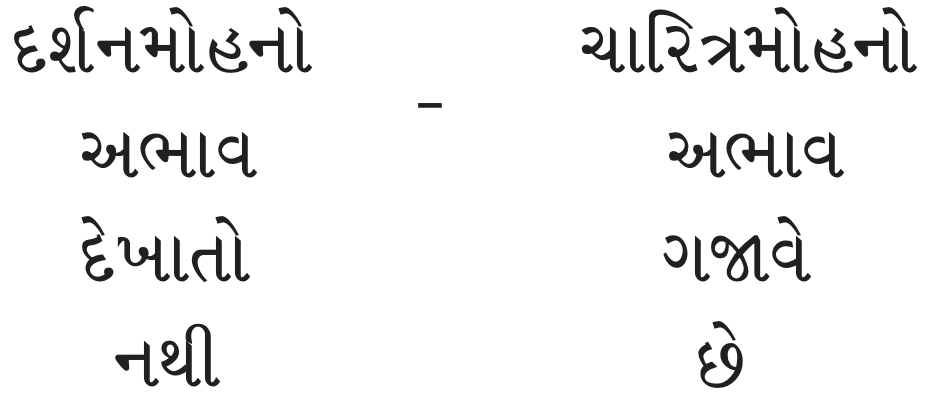

The world does not pay heed to the absence of faith-delusion but it focuses on and proclaims the absence of character-delusion alone.

One praises thus, “This person does not even eat bread, he has been celibate since so many years...” So what? Look at his faith-delusion. He has not taken a single step on the spiritual path at all. Even if he has not touched non-vegetarian food or ‘kandmool,’ (Forbidden vegetables), etc. Now, unless you work on faith delusion, nothing else is worth anything. Who else but the Enlightened will explain this subtle path? Why have we failed infinite times? Because our only focus has been ‘character-delusion.’ We have never focused on faith-delusion. Our false beliefs have remained intact. They might even have increased if you worship false deities or the Dispassionate Lord with the wrong intention. Thus if you cannot see faith-delusion and have focused on character-delusion alone, you will repent as you have wasted your whole human birth. The work that is to be done is understanding the true nature.

Now if the second state is weak, where there isn’t doubtless adherence to the ajna of the Enlightened One, there is no faith, love, surrendership in the Sadguru, when you come to the third state, you will certainly remain weak there as well. The fourth step won’t come at all and you should not even wish for the fifth step. To even dream of the fifth state without fulfilling the second one is a sin. Now these subtle tips of overcoming faith-delusion, you will get occasionally, like a medicinal tonic. Otherwise, the Sadguru explains the general topics of the scriptures. These tips will do the work on you. This is where the Enlightened One stands apart from the Charlatan. For the Sadguru has seen the eggs Himself. He has experienced the path Himself. The Guru says, “I too was trapped in faith-delusion once and am freed of it now, so I know what it is to get trapped in it and what is the path to come out of it as well.” He has seen it Himself.

‘That the knots of attachment have broken is a truth that cannot be disputed in all time. That this soul has attained self-realisation is indisputable.’ Such irrefutable clarity in the letter written by Prabhu on Kartak sud 14, Vikram Samvat, 1947. Such confidence and such a clear proclamation and resonance of experience. Who can speak with such confidence as Prabhu did? To proclaim, with a date? It is unchallengeable. There is no scope of speculation at all.

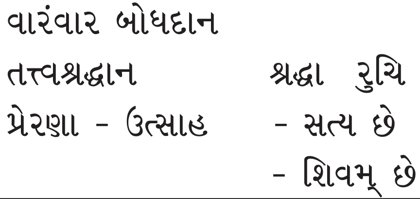

Now the seeker receives repeated guidance and motivation and imbibes it as eternal truth with unrelenting faith. The seeker is now not interested in different varieties of discourses and talks. He knows that he has limited time. His own spiritual eligibility tells him that he must deepen the guidance received from his Sadguru’s words, and bring it into contemplation and feeling. So far these words received are only at the listening level. This process of deepening too will need time. I can't waste it in irrelevant magazines and video clips, all of this is nothing more than a mental affliction. Now, bring it all to the feeling level. I enjoy listening a lot, but now it must reach a stage where it becomes an effortless experience. Now this is the work alone.

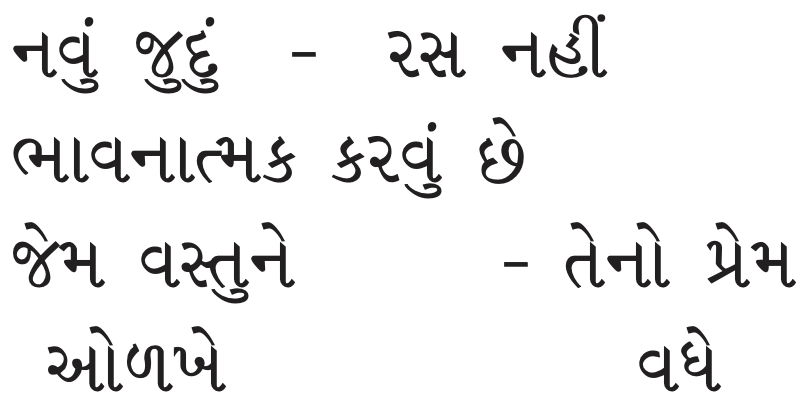

Now, 3 three things happen. 

1. Obstinacy, 
2. Dogged beliefs and 
3. self-will decrease. 

Obsessions and dogged opinion and ideas decrease. Every satsang will break some dogged ideas of yours. In Patrank-522, Prabhu clearly said that this much transformation you must experience, that the attitude of insistence of opinion, false insistence etc. start becoming weak. If you think that you are always right, why have you not attained samyag darshan? This is no more than a dogged belief. Prabhu has said the same thing in many stanzas of ‘Shri Atmasiddhi Shastra’ about this false insistence. You do not realise that it is your opinion, and it has no relation to facts.

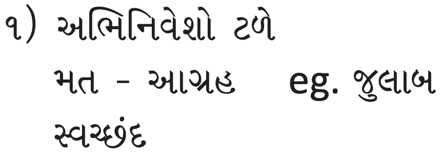

First of all, you are given a purgative to get rid of old excreta within and only then are you ready for new food. You have to leave all your old insistence and opinions. Even if you like the absolute viewpoint and do not like and accept the relative viewpoint, you are going to need a purgative. If you like any single viewpoint, you need to get rid of that old excreta. Once you get rid of it, your strength of desire for knowledge increases, the strength of reflection increases, strength of detachment grows, and with that you attain the strength of discretion. As one receives teachings from the Enlightened One, these four increase and the seeker attains a firm resolve in Truth. What truths unfold? We will discuss a few.

The distinction and the independence of each substance. Living and nonliving substances are both distinct, further, even the soul of one is distinct from that of others. The Self and the Non Self. This distinction and independence entails that the ‘non Self’ or the ‘other’ can neither benefit nor harm you. ‘I am distinct from everyone in every way.’ This becomes an unyielding resolve within. Remember the distinction and the independence of every substance from the other in every way as well. It is not just distinct, it is independent as well. You may think that while each substance is distinct, it can affect each other at least. But that too is not true. One substance cannot even affect the other in anyway.

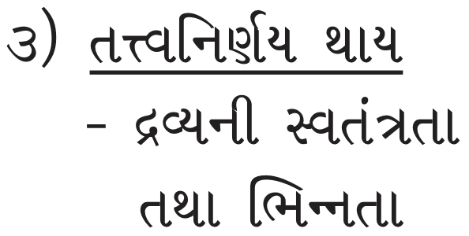

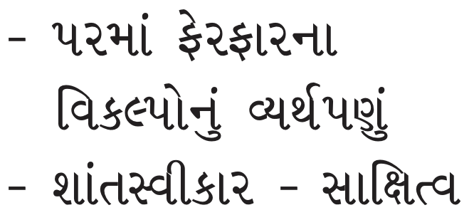

In easy words, we can say, “One substance cannot do anything to the other substance.” Or to simplify even further you can say, “External factors cannot benefit me or harm me.”

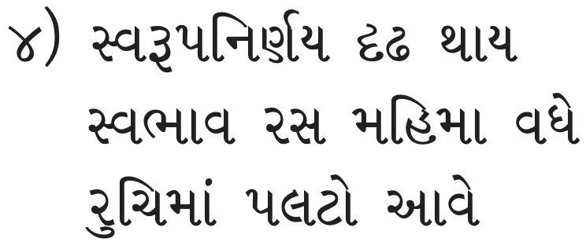

Once you entrench this truth in your belief system, all your thoughts will be purged effortlessly. You will wonder why you were attached in the first place? Then if that attachment is not entertained, why have aversion? All your confusions are now gone.

2. You realise the futility of thoughts about changing the external factors. Situations keep changing and your old habit is to try and change things as per your convenience. Here you have the thought of changing the external factors. But now you realise the futility of changing the external things. You have realised, ‘I cannot do anything outside, then why was I trying to teach someone a lesson?’ Now he knows that even this thought is futile. If his meritorious karma is more and your unmeritorious karma are more, he will harass you for your whole life. You might attain samyag darshan, samyag charitra, and omniscience, but he will still harass you. Now you know that there is no point in trying to teach him a lesson at all. It is better that you mind your business. Your life will change completely.

Just remember these five steps. You will know that every satsang is emphasizing them.

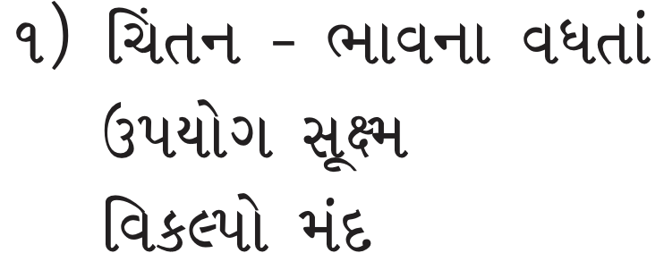

3. Turn from glad acceptance towards witnessing mode. First of all, you have to practise glad acceptance. Then leave aside acceptance and remain glad and peaceful. Thus if you keep contemplating, the importance of the soul increases, within you. You want to attain self- realisation. Then hearing the scriptures, pursuing knowledge, complete renunciation, and the position of Head of the congregation will all be successful.

4. Connection with the soul- bhed vijnan (Discriminating between the self and the non-self), inward focus. Once you have determined that you want to attain the true nature of the soul, your interest and liking are for the soul only. But your awareness is not transformed yet. The liking and interest are like a thin thread, but awareness is like a thick rope. The liking and interest cannot pull your awareness completely. This fourth step. Here Prabhu explains bhed jnan in the fourth step of Patrank-166, “4. The path to liberation is not outside but within the Soul. The One who has attained the path shall help attain it.”

## ભેદજ્ઞાન આત્માનુસાંધન ઉપયોગ અંતર્મૂખ

Once you have this awareness, there will be nothing outside, everything will be done within. Start bhedjnan (discrimination between the self and non-self).

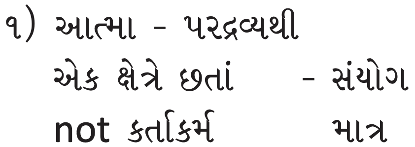

- I realise that I am different from all the external substances. This body and I are at the same place, but I am not the body, it is not mine. This is the first step of bhed jnan. 

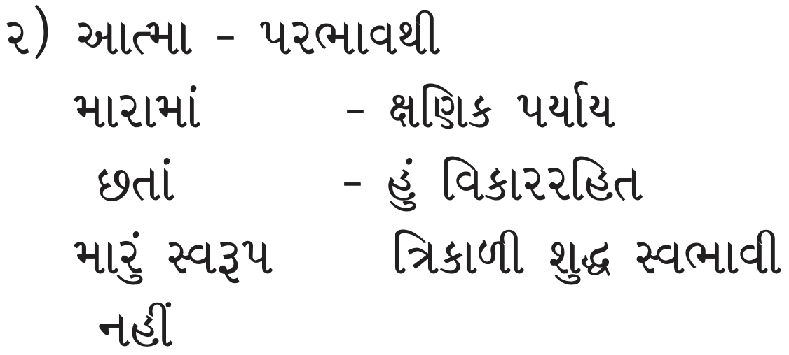

- I am different from the impurities. They are within me, but they are not entering the territory of my knowledge. I am not a modification, I am an eternal, Pure Soul. This is your inner practice.

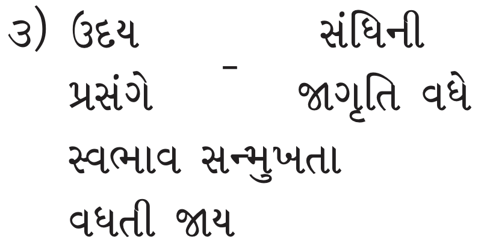

Now get into any activity with a goal, purpose, enthusiasm, awareness of the true nature, checking of thoughts and feelings, and vigilance of witnessing mode. If you follow these steps, your initiation or reading the scriptures, etc. won’t become futile. All your love is going within. The words used are tough, but the feeling is light, divine, and towards the divine union.

Now in the fourth state, you won’t have the pain of separation. If your awareness is focused within, you can experince the soul. You will not run outside. Pujyashri Lalluji Muni told Prabhu, “Now if You will tell me, then only I will come.” There was no sulking or ego issue here. Now he was focusing within. He was doing bhedjnan now and at the time of fruition of karma, he had the awareness of his connection with the soul. Earlier when there was the fruition of karma, you kept complaining, “This is adversity, this is favourable, this is the fruition of my painful karma” This way you labelled the fruitions. Now you see whether you got connected with that situation, you just take the chisel and cut the connection with your subtle intellect.

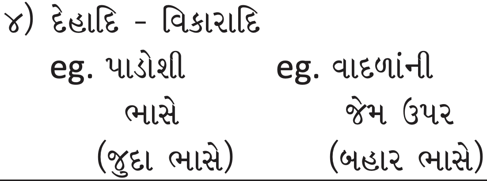

If you have a very close connection with your thoughts and feelings, it is intensive bondage. If it is a weak connection, it is weak bondage. Now in the fourth state, you feel that the body, etc. (mind, intellect) are different than you, they are like neighbours for you. You feel that thoughts are like clouds and they are not part of you. Your awareness starts getting frozen. 

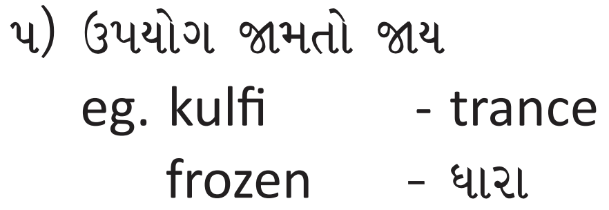

Just imagine that you are milk and you are in the refrigerator. After a while, you start freezing into an ice- cream. You keep freezing in the true nature of the self. You are so frozen within that you are not getting disturbed with whatever is happening outside. This is the path of liberation. The path of the soul is within.

## નિર્વિકલ્પ અનુભુતિ

Experience of Thoughtlessness (nirvikalp anubhuti): Inner silence, quiet, soundless. In this state, your awareness becomes subtler and you go into the inner silence. This is also a type of mediation only. If you have only one thought- ‘soul’, you can call it nirvikalpa meditation only, this is from one viewpoint.

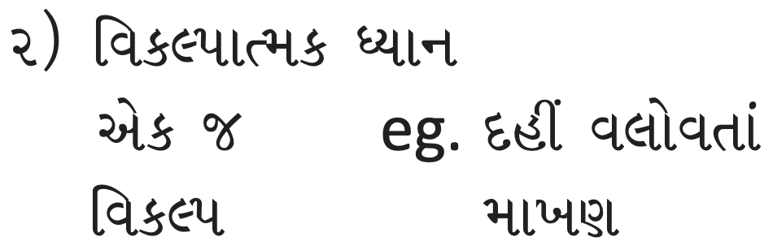

When you are churning the buttermilk, in the beginning, nothing comes out. Then slowly butter starts coming out. In the same way, you realise that whatever you read in the scriptures about the soul and had faith in it, now that starts appearing to some extent. When there is a complete experiential level, the soul manifests completely.

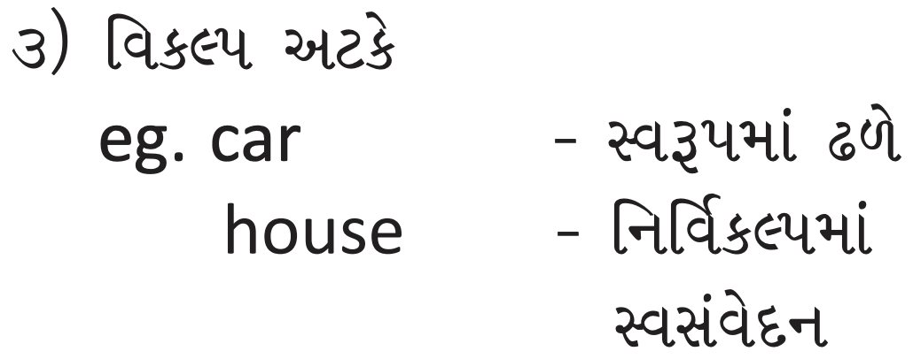

You realise that because the Sadguru asked, you had aimed to experience the soul which was indistinct. You had never known the soul before. You had faith in the Sadguru and you said that He had seen the soul, known it, and experienced it. Now you can feel it. The car has come near the gate of the house. You cannot take the car inside the house. Your thoughts won’t last long. You have to come out of the car.

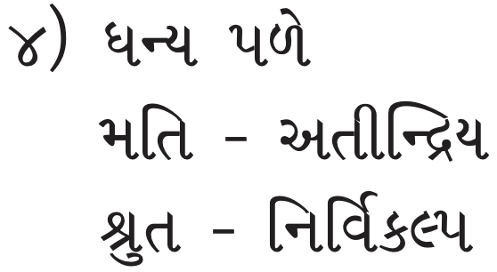

At a fortunate moment, sensory knowledge (matijnan) becomes extrasensory (atindriya), and scriptural knowledge or sensory knowledge (shrutjnan) becomes thoughtless (nirvikalpa). In this state, the soul can be experienced.

## પરમક્રુપાળુદેવનો મહિમા

“5. The path is contained in two letters”.
 With the ajna of the Enlightened One, go towards the thoughtlessness. You will attain unprecedented bliss and infinite peace. Even if there is a lot of noise outside, you are in that inner silence. You cannot hear any noise as if you are deaf. Prabhu used to be Zaveri Bazar, but He could not hear any noise. He was amongst the world, but He could not listen to the clashes and afflictions. He was among the fruition of karma, but He did not know whether it was a sin or meritorious karma. You go into an effortless meditation.

When a mother is breastfeeding a baby, the baby’s eyes are closed, still, he sucks milk from the mother’s breast. In Zaveri Bazar, Mumbai, the cook used to feed Prabhu, as Prabhu did not open the eyes. Anandmayi Ma was in the same condition. Someone fed Her 40 puris, but she did not know about it. Her consciousness was so much within that She could not even say no.

The cook used to feed Prabhu when He used to be in deep meditation. After one or one and a half hours, when He came out of meditation, He told the cook, “I feel that the stomach is full. Have I eaten?” And the cook said, “You ate one and a half hours before.” Let’s offer our salutations to this state of Prabhu. Whatever Yogis cannot do in the caves, Prabhu attained it in Mumbai in the firm. He only had awareness of the Pure Soul while sitting, standing, eating, and drinking.

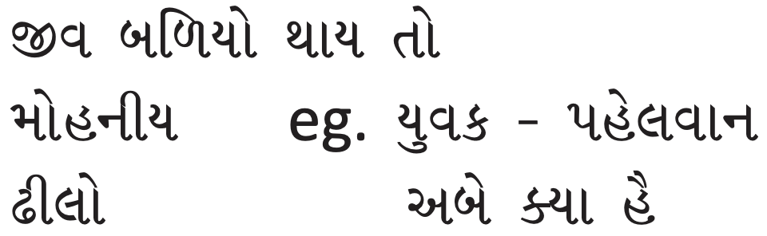

If the soul becomes powerful, delusional karma becomes weaker. A young man was walking on the pavement and a brick fell from the terrace. He was hurt and he was very angry. He decided to go up and hit the person who threw the brick. He went on the terrace only to see a wrestler exercising. The moment the wrestler saw the young man, he shouted, “What do you want?” The young man said, “Nothing.” In the same way, if the soul becomes powerful, delusional karma becomes weaker. Why do you get scared of faith delusion?

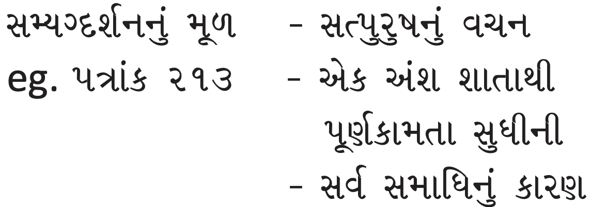

The soul has to become powerful. For that, there is only one remedy- Ambrosial words of the Enlightened One. In Patrank-213, Prabhu has said, “I understand that the cause of every state of well-being, from an iota of comfort to the state of complete fulfilment is solely an Enlightened One.” All your happiness is because of the Enlightened One only.

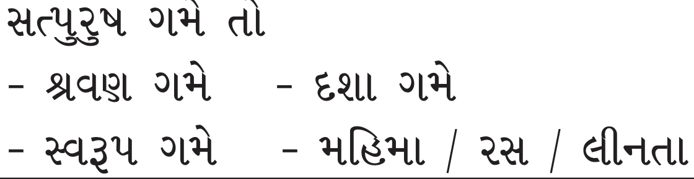

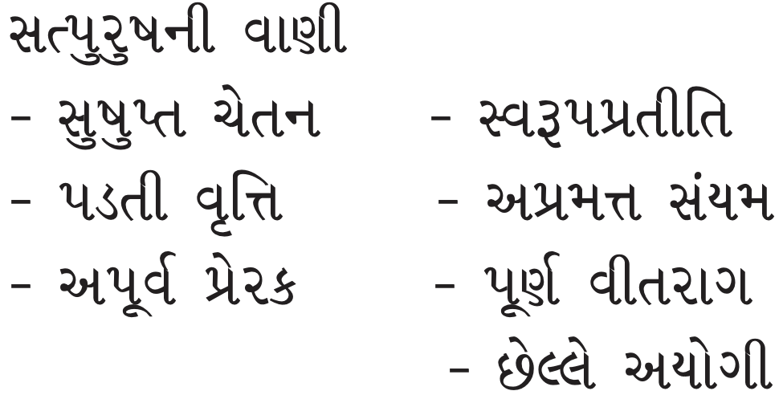

The ambrosial words of the Enlightened Ones are universally beneficial. Their countenance and wholesome contact are helpful in awakening the soul from its state of slumber, they prevent the falling tendency and stabilise it. They are faultless, become helpful in manifesting the unique pure nature, and are a treasure of all virtues. They provide the conviction of pure nature that enables the observance of indolence-free restraints and leads to total detachment and state beyond thought. This would ultimately give rise to manifesting the state of non-activity of mind, speech, body, and lead to abiding in the endless and unobstructed self. The reason for all these things is the ambrosial words of the Enlightened One.

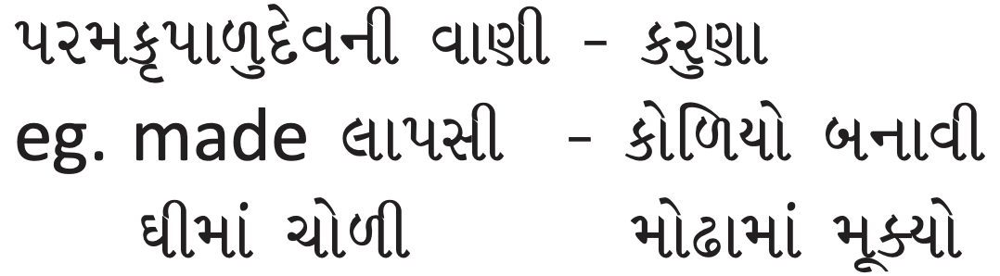

Patrank-166 is like lapsi. Prabhu has made laapsi (kind of sweet dish made of wheat flour) out of compassion for us, He added ghee in it. He made a morsel and put it in our mouths. Now we have to give up our laziness and eat it. Just as a mother puts oils each strand of hair, Prabhu has put given rise to the importance of the soul within us. This should penetrate in every part of our being. This is the compassion of the Enlightened One.

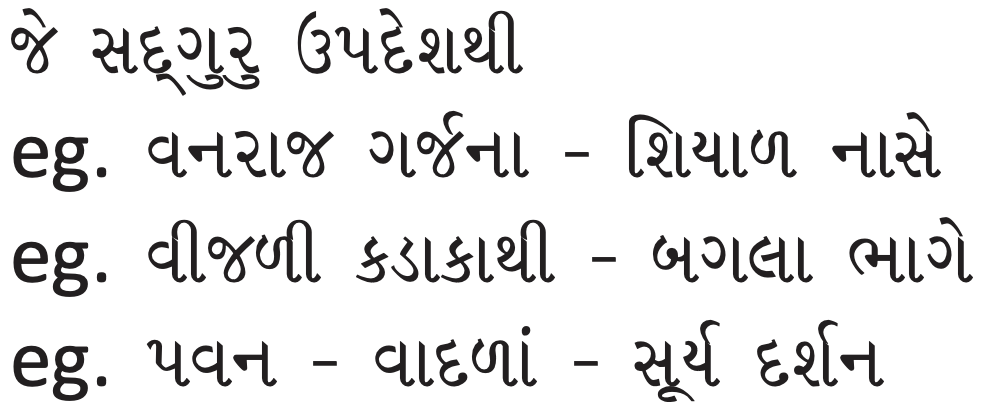

Once the lion roars in the jungle, all the animals like the fox run away. When there is lightning in the sky, cranes and herons run away in fear. If there is a strong wind, the cloud moves away. The Sadguru’s precept is like the roaring of the lion because of which false beliefs, ignorance, and wrong intellect get annihilated. Let’s offer our salutations to Param Krupalu Dev.

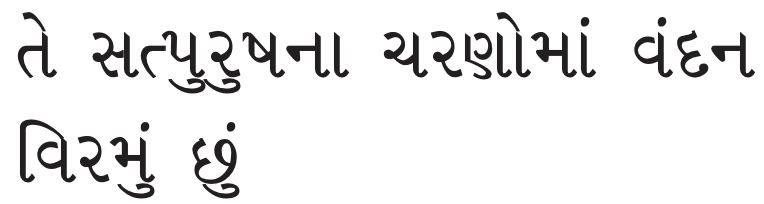

## Types of Samyak Darshan

1. Vyavahar Samkit - Phase 1
2. Nischay Samkit - Phase 2

Vyavahar is about true faith in God, Religion, differences between self and non-self. This helps develop faith in the true nature of the soul. This is a stepping stone to Nischay Samkit.

Nischay Samkit is about experiencing the soul - even for a small amount of time and developing strong faith in the eternal pure nature of the soul. There are three types and are related to fruition of karmas:

- Upsham - Suppression of Karma
- Aupshamic Samkit - After achieving Nischay Samkit, when some Darshan Mohaniya karma are suppressed - meaning not coming to fruition and in dormant state. 
- Kshyayopshamic Samkit - Continuing from above, if some Mohaniya karmas that are in dormant state are completed removed, while some karmas remain in dormant state. 
- Kshayik Samkit - Continuing from above, when all Mohaniya karmas that remained in dormant state are completed removed.

