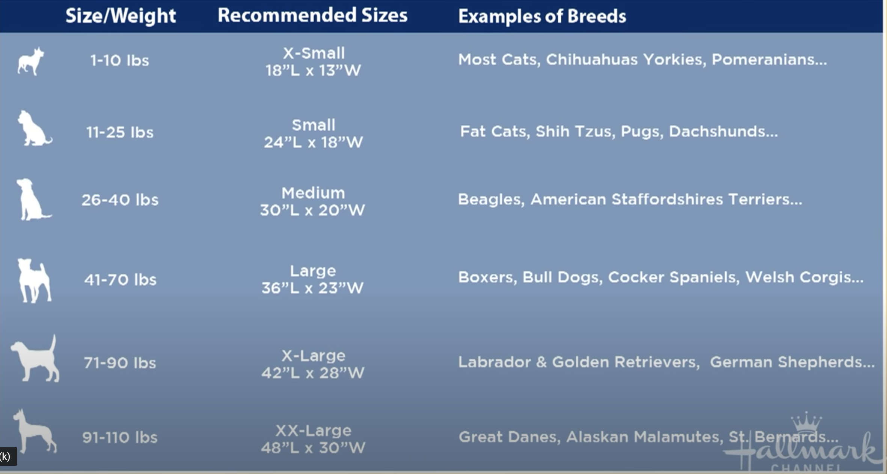

[toc]

## First few weeks

### Items

- Adjustable collar and leash
- Collar tags with contact info
- Food and water bowls
- High-quality puppy food
- Poop bags and holder
- Dog bed (for puppy’s first night)
- Toys and treats (start simple, you’ll learn your puppy’s preferences in about a month
- Playpen and baby gates
- Crate
- A ticking clock helps.  It reminds the puppy of her moms heartbeat. Use it only the first few weeks when she cries a lot but then ween her off it. Tabla definitely helps  (*my son plays tabla*).
- My Plan
   - Bed is 45”x35”
   - Equine pine pellets bedding

### First weeks

- *Picking her up*:  When you go to pick up your puppy to bring them home, take an old towel with you, and wipe it on her mom (if available) or her siblings.  Then use that towel for wherever she sleeps.  Wait till she cries at night and then give it to her.  The smell will soothe her nerves.  You can also ask the breeder to wash the mom and use a towel to dry that they can give you. The smell will last longer.
- *Starting Day 1*:  As soon as you get your new puppy home, take them to their “potty spot.” When she is done, praise her right away with lots of positive vocalizations and a treat. Try to make sure they go potty outside before you take them indoors.
- After your puppy is inside, plan on potty breaks every one to two hours. Accidents will happen, but you can start your puppy off on the right paw by establishing a schedule right away. Definitely do more frequent right after meals.
- Make sure house is quiet on the first day.  It’s already a shock to him because of change. TV can trigger nervousness. 
- The first day (and first night) with your puppy is a time to teach them that they’re part of the family. But I always immediately start a routine, as well as physical boundaries, to teach them proper in-home behavior.  Everyone in the house should be consistent.
- You can establish boundaries and help your puppy get used to his new home on the very first day by setting up a “puppy zone.”
- It can include her bed, crate, toys, and food and water bowls, all surrounded by a fence or border that keeps him from wandering away while no one’s looking.
- Show your new puppy their home base as soon as they get home, and throw some treats in so they enter it of their own accord. The more fun you can make it, the more likely they are to settle in quietly.  Don’t give too many treats either even if it’s tempting.  
- A trick to prevent excessive barking when someone comes is to from day one knock on the door and then after a few minutes come inside. But do this consistently the first few weeks many times in the day.  I personally like when they bark at the door so I don’t do this.
- *Night time*: Don’t expect sleep the first month.  Some puppies are quicker.  Simba took about six weeks. 
- She will wake you up a few times. Like human babies, puppies wake up throughout the night. 
- Establish a bedtime routine on your first day and stick to it. While the first night may be challenging, a routine will help her understand what’s expected all of you go to sleep.
- Some people like to have the puppy’s crate in their bedroom, others prefer for the puppy to be in their own room from the beginning. The important thing is to establish a specific sleeping place to help your puppy get the routine. You can make it a warm, inviting place with a nice bed and snuggly toy.
- One thing that helps is get one of your tshirts and let it become hers.  Put it in the crate .  She will recognize the smell of you and it will comfort her.
- Also putting her inside playpen when you guys eat meals is important.
- Eventually the playpen will go away but the scent around the crate will stay so she will adapt and want to return to that area more willingly.
- We averaged about 4 beds a year for the first two years because he would chew on them. After that about two beds a year. The Costco ones are the best. And we only bought the ones that fit in the crate the first year. We didn’t use crate after the first year. Just a bed which we called home. So we could just tell him go home and he knew what to do. But call the bed home from day one.

### Hand made ideas

## Vegan DIY

- Once dogs grow old, they need more carbs and less proteins. Replace beans with oats

### Sample 1

 https://www.youtube.com/watch?v=M75dWaFRYgo

**INGREDIENTS**

- 2 cups brown rice 
- 1 cup quinoa 
- 1 cup barley 
- 1 cup soy - either soy beans, TVP or tofu  
- Green veggies Other veggies (please check what veggies NOT to feed your dog) 
- Chia Seeds & yeast flakes 
- Powered soy milk
- Vegan dry food for supplements (BioPet)

### Whole Foods Plant-Based (Vegan) Dog Food

http://www.mrsplantintexas.com/2015/05/homemade-whole-foods-plant-based-vegan.html

**INGREDIENTS**

- 1 cup dry organic brown rice
- ½ cup dry lentils
- 1 cup garbanzo beans, measured after being soaked or cooked
- 1 cup great northern or navy beans, measured after being soaked or cooked ***(replace with 1 cup of oats if your dog is over the age of 7)\***
- 1 1-lb bag organic frozen spinach, **NOT** thawed
- 1 1-lb bag organic frozen peas, thawed
- 1 1-lb bag organic frozen green beans, thawed
- 1 1-lb bag of frozen broccoli or cauliflower (optional but healthy and will extend the food)
- 1 lb organic carrots, shredded in food processor or chopped small (you can also buy them pre-shredded)
- 1/2 cup chia seeds
- 1/2 cup ground flaxseed
- 7 cups water
- 1 can of organic pumpkin (optional)
- 1 1/2 cups cooked sweet potatoes (optional)

**DIRECTION**

- Shred carrots in food processor or chop into tiny dice by hand. 
- Transfer to pressure cooker.
- Then, change to an S-blade and process cooked or soaked beans to a medium coarseness.
- Add to pressure cooker. Add rice, lentils, peas, green beans, broccoli, and spinach plus water.
- Cook for **9 minutes with natural release**. It can take almost 45 minutes for the pressure to come down and release. 
- Stir in chia seeds and ground flaxseed. 
- If adding, stir in 1 can of organic pumpkin and 2 or 3 cooked sweet potatoes. Cool and put into individual containers with tight lids and freeze for future use.

### Peanut-Butter-Oat Treats

 http://www.mrsplantintexas.com/2015/05/peanut-butter-oat-dog-treats.html

### Banana and Carrot Cookie

**INGREDIENTS**

- 2 carrots
- 1 ripe banana
- 1 tablespoon of chia seeds + 3 tablespoons of cold water
- 2 tablespoons of extra virgin coconut oil
- 1½ cups (200g) of of buckwheat flour or coconut flour?

**DIRECTION**

- Wash and grate the carrots. Combine the chia seeds and water in a small bowl and set aside for 10 minutes to thicken.
- Mash the bananas with a fork and add to a food processor or mixing bowl. Add the chia mix, coconut oil, grated carrots and flour. Stir well until a dough forms. If the dough is too sticky, add a little bit more of the flour.
- Pre-heat the oven to 180°C (360°F).
- Roll out the dough between two sheets of baking paper and cut out the dog treats with a cookie cutter (I used a bone shaped one :)).
- Transfer the cut-out cookies to a baking tray that you aligned with baking paper.
- Bake the dog treats for about 20 - 25 minutes until golden brown and crisp.
- Let them cool completely before serving them to your dog.
- Stored in an air tight container, they should last for about a month.

### Other ideas

- pumpkin, brown rice, flax, and canned "good" dog food.
- Yogurt (no sugar), White rice, Sweet Potato, Pumpkin, 

### OK Veggies and Fruits

- http://www.mrsplantintexas.com/2015/05/homemade-whole-foods-plant-based-vegan.html

- Apples - A, C, Fiber
- Banana - Potassium, Fiber, Vitamins - High in sugar, so not too much, frozen bites
- Blue Berries - Anti Oxidants
- Brussels sprouts - A, C, Manganese, Fiber - in moderation, gassy
- Broccoli - immunity - in moderation, gassy
- Cantaloupe - A, Beta Carotene, high suger, in moderation
- Celery - Low calorie, A, B, C, Phosphorus, crunches help in teeth and breath
- Cucumber - low carb, high nutrients, 
- Carrot - Low cal, crunches help in teeth and breath
- Green Beans - Low cal
- Mangoes - A, B6, C, E - small pieces
- Oranges - small pieces
- Oil - Coconut, Flaxseed, Olive - a teaspoon daily or weekly for a 50lb dog. Coconut oil can also be rubbed on the skin.
- Parsley - in moderation for teeth cleaning. Chop and mix with food.
- Pineapples - enzymes, bromeliad, freeze and give, avoid canned
- Peas - Protein, Fiber, Vitamin, avoid frozen with salt. 
- Peanut Butter, Yogurt, Banada - into frozen pieces - https://cookingwithjanica.com/yogurt-peanut-butter-banana-dog-treats-recipe/
- Pear - small pieces
- Peaches - small pieces, avoid canned
- Potatoes - same as Sweet Potatoes
- Pumkin  - helps in diarrhea, constipation - plain in flavor, canned is good
- Quinoa
- Rasberries - in moderation
- Spinach - in frequently, once a month. 
- Sweet Potato - small pieces after they have been cooked. 
- Watermelon - best in summer
- Strawberries - C, Fiber

### Not OK Veggies and Fruits

- Avacado
- Grapes
- Onions
- Cherries
- Tomatoes
- Mushroom
- Asparagus

## DIY References

- Bed 
  - https://www.youtube.com/watch?v=Jf4i4qPLBwY
  - Stall Dry concept?
- Toys:
  - https://www.youtube.com/watch?v=U4L8s1PI7pg
  - Knots
    - Leach Ideas
      - https://www.youtube.com/watch?v=HkqVIsideL8
      - https://www.youtube.com/watch?v=iYfAX6Xzbmk
      - https://www.youtube.com/watch?v=XyAwYv2QDw0
      - https://www.youtube.com/watch?v=T2m1Js4ukh0
      - https://www.youtube.com/watch?v=usvKJAbr9do
    - https://www.youtube.com/watch?v=WcWaKWWviu0
    - https://www.youtube.com/watch?v=FzTUxDVGHVA
    - https://www.youtube.com/watch?v=P6dcpgZGLAw
    - https://www.youtube.com/watch?v=orVRqm9Ms_Y
    - https://www.youtube.com/watch?v=yF3gPo0TsbE
    - https://www.youtube.com/watch?v=cVIXeFTUx7U
    - https://www.speedyjig.com/

